# Autonomous Rocker-Bogie Rover — ROBOFEST!!!

> **Competition-grade autonomous six-wheel rover for ROBOFEST.**
> Obstacle navigation · terrain traversal · dynamic obstacle avoidance · precision autonomous parking.

---

> **Repository Status:** This repository is currently in the **architecture and bring-up phase**.
> All software modules listed in this document are marked with their actual implementation status.
> No capability is falsely claimed as implemented.
> This document serves as the **single source of truth** for system architecture, hardware specification, software design, and development roadmap.

---

## Table of Contents

| # | Section |
|---|---|
| 1 | [Project Overview](#1-project-overview) |
| 2 | [Competition Objective](#2-competition-objective) |
| 3 | [Rover Specifications](#3-rover-specifications) |
| 4 | [Mechanical Architecture](#4-mechanical-architecture) |
| 5 | [Rocker-Bogie Suspension](#5-rocker-bogie-suspension) |
| 6 | [Hardware Architecture](#6-hardware-architecture) |
| 7 | [Sensor Architecture](#7-sensor-architecture) |
| 8 | [Electrical Power Architecture](#8-electrical-power-architecture) |
| 9 | [Dual-Processor Architecture](#9-dual-processor-architecture) |
| 10 | [Communication Architecture](#10-communication-architecture) |
| 11 | [ROS 2 Architecture](#11-ros-2-architecture) |
| 12 | [ROS 2 Nodes](#12-ros-2-nodes) |
| 13 | [ROS 2 Topics](#13-ros-2-topics) |
| 14 | [Sensor Fusion](#14-sensor-fusion) |
| 15 | [Localization](#15-localization) |
| 16 | [SLAM](#16-slam) |
| 17 | [Global Path Planning — A\*](#17-global-path-planning--a) |
| 18 | [Local Path Planning — DWA](#18-local-path-planning--dwa) |
| 19 | [Obstacle Detection](#19-obstacle-detection) |
| 20 | [Small Object Detection](#20-small-object-detection) |
| 21 | [Dynamic Obstacle Handling](#21-dynamic-obstacle-handling) |
| 22 | [Motion Control](#22-motion-control) |
| 23 | [Wheel PID](#23-wheel-pid) |
| 24 | [Heading Control](#24-heading-control) |
| 25 | [Parking Algorithm](#25-parking-algorithm) |
| 26 | [Recovery System](#26-recovery-system) |
| 27 | [Mission State Machine](#27-mission-state-machine) |
| 28 | [QR / ArUco / Marker Decision System](#28-qr--aruco--marker-decision-system) |
| 29 | [Safety Architecture](#29-safety-architecture) |
| 30 | [Emergency Stop](#30-emergency-stop) |
| 31 | [Arduino Firmware Architecture](#31-arduino-firmware-architecture) |
| 32 | [Raspberry Pi Software Architecture](#32-raspberry-pi-software-architecture) |
| 33 | [Complete Data Flow](#33-complete-data-flow) |
| 34 | [Hardware BOM](#34-hardware-bom) |
| 35 | [Software Stack](#35-software-stack) |
| 36 | [Folder Structure](#36-folder-structure) |
| 37 | [Testing Strategy](#37-testing-strategy) |
| 38 | [Failure Handling](#38-failure-handling) |
| 39 | [Simulation](#39-simulation) |
| 40 | [Previous vs New Rover](#40-previous-vs-new-rover) |
| 41 | [Known Limitations](#41-known-limitations) |
| 42 | [Implementation Status](#42-implementation-status) |
| 43 | [Development Roadmap](#43-development-roadmap) |
| 44 | [Future Improvements](#44-future-improvements) |
| 45 | [Team / Project Information](#45-team--project-information) |

---

## 1. Project Overview

| Field | Value |
|---|---|
| **Project** | Autonomous Rocker-Bogie Rover |
| **Competition** | ROBOFEST |
| **Rover Generation** | Second generation (upgraded from previous year) |
| **Chassis** | 6-wheel drive, rocker-bogie suspension |
| **Steering** | Differential / skid steering |
| **High-Level Processor** | Raspberry Pi 5 (8 GB) |
| **Real-Time Controller** | Arduino Mega 2560 |
| **Middleware** | ROS 2 |
| **Primary Navigation** | Waypoint-based autonomous navigation |
| **Repository Status** | Architecture / Bring-Up Phase |

### Design Philosophy

This is not a research prototype.
The design goal is **repeatability, reliability, and safe autonomous operation** across 6–7 consecutive competition laps on mixed terrain with dynamic obstacles.

**Priority hierarchy (highest to lowest):**

```
EMERGENCY STOP
      ↓
SAFETY
      ↓
COLLISION AVOIDANCE
      ↓
RECOVERY
      ↓
PARKING
      ↓
MISSION
      ↓
PATH FOLLOWING
```

Every architectural decision is made in service of this priority order. Safety always overrides navigation. Navigation never overrides safety.

---

## 2. Competition Objective

The rover must autonomously complete approximately **6–7 rounds/laps** on a course containing:

| Challenge | Description | Priority |
|---|---|---|
| Autonomous navigation | Navigate waypoints without human input | Critical |
| Obstacle detection | Detect static and dynamic obstacles | Critical |
| Dynamic obstacle avoidance | Stop, wait, or replan when path is blocked | Critical |
| Small object detection | Detect low-profile objects below LiDAR plane | High |
| Terrain traversal | Traverse uneven ground, ramps, rough surfaces | Critical |
| Emergency stopping | Immediate safe stop on demand | Critical |
| Path replanning | Replan when primary path is unavailable | High |
| Accurate turning | Precise heading control on course turns | Critical |
| Marker/sign following | QR / ArUco / symbolic sign decision making | Medium |
| Autonomous parking | Precision final parking at end zone | High |
| Final position alignment | Heading and position alignment at park | High |
| Reliable repeated operation | Must not fail across 6–7 consecutive rounds | Critical |

---

## 3. Rover Specifications

| Parameter | Value |
|---|---|
| Wheel configuration | 6-wheel drive (6WD) |
| Suspension | Passive rocker-bogie |
| Steering | Differential / skid steering |
| Motors | 6× geared DC motors with encoders |
| Motor type | Brushed DC (to be confirmed — TBD) |
| Wheel diameter | TBD |
| Track width | TBD |
| Wheelbase | TBD |
| Chassis material | TBD |
| Total mass | TBD |
| Ground clearance | TBD |
| Max obstacle height (climb) | TBD (≈ wheel radius — To Be Verified) |
| Max speed | TBD m/s |
| Operating voltage | 24 V |
| Battery capacity | TBD Ah |
| Battery chemistry | TBD (Li-ion/LiPo/LiFePO₄) |
| Estimated run time | TBD min |

> All TBD values must be measured/verified on the physical hardware before competition.

---

## 4. Mechanical Architecture

### 4.1 Six-Wheel Layout (Top View)

```
                    FRONT
        ┌─────────────────────────────┐
        │  [LF]              [RF]     │
        │                             │
        │  [LM]              [RM]     │
        │                             │
        │  [LR]              [RR]     │
        └─────────────────────────────┘
                    REAR

LF = Left Front     RF = Right Front
LM = Left Middle    RM = Right Middle
LR = Left Rear      RR = Right Rear

Left group:  LF + LM + LR → driven together (differential left side)
Right group: RF + RM + RR → driven together (differential right side)
```

### 4.2 Skid Steering Motion Modes

| Mode | Left Wheels | Right Wheels |
|---|---|---|
| Forward | Positive velocity | Positive velocity |
| Reverse | Negative velocity | Negative velocity |
| Turn left | Slower | Faster |
| Turn right | Faster | Slower |
| Rotate CW (in-place) | Negative | Positive |
| Rotate CCW (in-place) | Positive | Negative |
| Stop | Zero | Zero |

### 4.3 Sensor Mounting (Planned)

| Sensor | Mounting Location |
|---|---|
| LiDAR | Roof / top centre, unobstructed 360° |
| AI Camera | Front, elevated for forward arc view |
| ToF #1 | Front-left, angled slightly downward |
| ToF #2 | Front-centre, angled slightly downward |
| ToF #3 | Front-right, angled slightly downward |
| Ultrasonic #1 | Front bumper |
| Ultrasonic #2 | Rear bumper |
| IMU | Chassis centre, aligned with rover axes |
| GPS | Top, clear sky view (if used) |

> Exact mounting positions, angles, and offsets must be measured and entered into the URDF/TF static transforms before navigation is enabled.

---

## 5. Rocker-Bogie Suspension

### 5.1 Mechanism Description

The rocker-bogie is a **passive, actuator-free** suspension system developed originally for NASA Mars rovers. It allows six wheels to maintain ground contact on uneven terrain without active control, hydraulics, or springs.

**Components:**

| Part | Function |
|---|---|
| Rocker arm (×2) | Long arm connecting one side's front bogie to rear wheel and chassis pivot |
| Bogie arm (×2) | Short arm connecting front and middle wheels on each side |
| Central pivot | Connects both rockers to the chassis. Allows differential rotation |
| Differential bar | Passive linkage connecting left and right rockers through the chassis pivot |

### 5.2 Side-View Diagram

```
                         CHASSIS
                    ___________________
                   /                   \
ROCKER L ─────────┤  Central Pivot      ├───────── ROCKER R
     │            │_____________________|              │
     │                                                 │
     ├── Rear Left Wheel [LR]           [RR] Rear Right ──┤
     │                                                    │
     └─BOGIE L─┐                               ┌─BOGIE R──┘
         │     │                               │     │
        [LF]  [LM]                           [RM]  [RF]
   Front-Left  Mid-Left               Mid-Right  Front-Right
```

### 5.3 Terrain Adaptation

```
FLAT GROUND:
   [LF]──[LM]──[LR]      [RF]──[RM]──[RR]
    ▼     ▼     ▼          ▼     ▼     ▼
 ═══════════════════════════════════════ (ground)

OBSTACLE (e.g. rock under LF):
   [LF]                  [RF]──[RM]──[RR]
    │  ↑ (raised)         ▼     ▼     ▼
    └──[LM]──[LR]      ══════════════════
        ▼     ▼
 ═══════════════════════ [rock] ═════════

   → Bogie tilts: LF rises, LM maintains contact
   → Rocker tilts: LR descends slightly to compensate
   → Chassis remains relatively level
   → All other 5 wheels maintain ground contact
```

### 5.4 Engineering Benefits

| Benefit | How Rocker-Bogie Achieves It |
|---|---|
| Terrain adaptability | Each wheel group adapts independently to local terrain |
| Continuous ground contact | Passive geometry ensures all 6 wheels touch ground on uneven surfaces |
| Stability | Low centre of gravity + wide track width + passive load distribution |
| Obstacle climbing | Can climb obstacles approximately equal to wheel radius |
| Load distribution | Weight shared evenly across all driven wheels |
| Reduced chassis pitch | Differential bar averages left/right rocker pitch, reducing body tilt |
| No actuators required | Zero power consumption for suspension — purely mechanical |

---

## 6. Hardware Architecture

### 6.1 Master Architecture Diagram

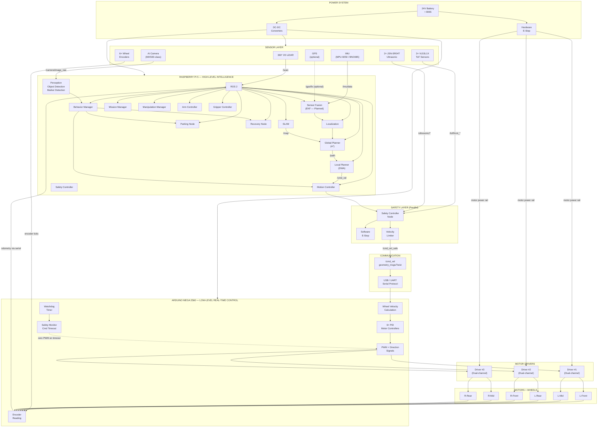
```mermaid
flowchart TD
    subgraph SENSORS["SENSOR LAYER"]
        LDR["360° 2D LiDAR"]
        CAM["AI Camera\n(IMX500-class)"]
        IMU_S["IMU\n(MPU-9250 / BNO085)"]
        TOF_S["3× VL53L1X\nToF Sensors"]
        US_S["2× JSN-SR04T\nUltrasonic"]
        ENC_S["6× Wheel\nEncoders"]
        GPS_S["GPS\n(optional)"]
    end

    subgraph RPI["RASPBERRY PI 5 — HIGH-LEVEL INTELLIGENCE"]
        ROS2["ROS 2"]
        PERC["Perception\nObject Detection\nMarker Detection"]
        SF["Sensor Fusion\n(EKF — Planned)"]
        LOC["Localization"]
        SLAM_N["SLAM"]
        GP["Global Planner\n(A*)"]
        LP["Local Planner\n(DWA)"]
        BM["Behavior Manager"]
        PKG["Parking Node"]
        REC["Recovery Node"]
        MM["Mission Manager"]
        ARM_M["Manipulation Manager"]
        ARM_C["Arm Controller"]
        GRP_C["Gripper Controller"]
        MC["Motion Controller"]
        SC["Safety Controller"]
    end

    subgraph COMM["COMMUNICATION"]
        CMDVEL["/cmd_vel\ngeometry_msgs/Twist"]
        SERIAL["USB / UART\nSerial Protocol"]
    end

    subgraph ARDUINO["ARDUINO MEGA 2560 — LOW-LEVEL REAL-TIME CONTROL"]
        WC["Wheel Velocity\nCalculation"]
        PID_A["6× PID\nMotor Controllers"]
        ENC_R["Encoder\nReading"]
        PWM_A["PWM + Direction\nSignals"]
        WDG["Watchdog\nTimer"]
        SFTY_A["Safety Monitor\nCmd Timeout"]
    end

    subgraph DRIVERS["MOTOR DRIVERS"]
        MD1["Driver #1\n(Dual-channel)"]
        MD2["Driver #2\n(Dual-channel)"]
        MD3["Driver #3\n(Dual-channel)"]
    end

    subgraph MOTORS["MOTORS + WHEELS"]
        MLF["L-Front"] & MLM["L-Mid"] & MLR["L-Rear"]
        MRF["R-Front"] & MRM["R-Mid"] & MRR["R-Rear"]
    end

    subgraph POWER["POWER SYSTEM"]
        BAT["24V Battery\n+ BMS"]
        ESTOP_HW["Hardware\nE-Stop"]
        DCDC["DC-DC\nConverters"]
    end

    subgraph SAFETY_LAYER["SAFETY LAYER (Parallel)"]
        SC_NODE["Safety Controller\nNode"]
        ESTOP_SW["Software\nE-Stop"]
        VL["Velocity\nLimiter"]
    end

    LDR -->|"/scan"| ROS2
    CAM -->|"/camera/image_raw"| PERC
    IMU_S -->|"/imu/data"| SF
    TOF_S -->|"/tof/front_*"| SC_NODE
    US_S -->|"/ultrasonic/*"| SC_NODE
    GPS_S -.->|"/gps/fix (optional)"| SF
    ENC_S -->|"encoder ticks"| ENC_R

    ROS2 --> SF & LOC & SLAM_N & GP & LP & BM & PKG & REC & MM & ARM_M & ARM_C & GRP_C & MC
    PERC --> BM
    SF --> LOC
    LOC --> GP
    SLAM_N -->|"/map"| GP
    GP -->|"/path"| LP
    LP -->|"/cmd_vel"| MC
    BM --> MC & PKG & REC
    MC --> SC_NODE
    SC_NODE --> ESTOP_SW & VL
    VL -->|"/cmd_vel_safe"| CMDVEL

    CMDVEL --> SERIAL
    SERIAL --> WC
    WC --> PID_A
    PID_A --> PWM_A
    PWM_A --> MD1 & MD2 & MD3
    MD1 --> MLF & MLM
    MD2 --> MLR & MRF
    MD3 --> MRM & MRR
    MLF & MLM & MLR & MRF & MRM & MRR --> ENC_R
    ENC_R -->|"odometry via serial"| ROS2
    WDG --> SFTY_A
    SFTY_A -.->|"zero PWM on timeout"| PWM_A

    BAT --> ESTOP_HW
    ESTOP_HW -->|"motor power rail"| MD1 & MD2 & MD3
    BAT --> DCDC
    DCDC --> RPI["RASPBERRY PI 5 — HIGH-LEVEL INTELLIGENCE"]
    DCDC --> ARDUINO["ARDUINO MEGA 2560 — LOW-LEVEL REAL-TIME CONTROL"]
    DCDC --> SENSORS["SENSOR LAYER"]
```

### 6.2 Compute Platform

| Property | Raspberry Pi 5 (8 GB) | Arduino Mega 2560 |
|---|---|---|
| **Role** | High-level intelligence, ROS 2, all navigation | Real-time motor control, PID, encoder I/O |
| **CPU** | Quad-core ARM Cortex-A76 @ 2.4 GHz | ATmega2560 @ 16 MHz |
| **RAM** | 8 GB LPDDR4X | 8 KB SRAM |
| **OS** | Ubuntu 22.04 / 24.04 | Bare metal (Arduino framework) |
| **Middleware** | ROS 2 (Humble or Iron) | Serial protocol (custom) |
| **Communication** | USB Serial / UART to Arduino | USB Serial / UART to RPi |
| **Real-time** | No (Linux kernel) | Yes (single-threaded loop) |
| **Performs SLAM** | Yes | No |
| **Performs A\*** | Yes | No |
| **Performs PID** | No | Yes |
| **Generates PWM** | No | Yes |
| **Reads encoders** | No | Yes |

> **Critical rule:** The Raspberry Pi never directly generates motor PWM. The Arduino never performs SLAM, A\*, or high-level navigation. Responsibilities are strictly partitioned.

---

## 7. Sensor Architecture

### 7.1 Sensor Responsibility Matrix

| Sensor | Qty | Primary Purpose | Secondary Purpose | Connected To | ROS 2 Topic | Failure Behavior |
|---|---|---|---|---|---|---|
| 360° 2D LiDAR | 1 | SLAM, obstacle mapping, 360° geometry | Global and local costmap | Raspberry Pi | `/scan` | Degrade to ToF+US only; reduce speed |
| AI Camera (IMX500) | 1 | Object detection, marker/QR detection | Parking zone identification | Raspberry Pi | `/camera/image_raw`, `/camera/detections` | Disable semantic detection; continue |
| VL53L1X ToF | 3 | Short-range obstacle, small-object detection | Parking alignment, final distance | Raspberry Pi (I²C) | `/tof/front_left`, `/tof/front_center`, `/tof/front_right` | Reduce speed; warn operator |
| JSN-SR04T Ultrasonic | 2 | Backup close-range safety | Rear obstacle detection | Arduino or Raspberry Pi | `/ultrasonic/front`, `/ultrasonic/rear` | Log warning; continue with reduced safety margin |
| IMU (MPU-9250 / BNO085) | 1 | Orientation, heading, angular velocity | Roll/pitch tilt monitoring, sensor fusion | Raspberry Pi (I²C/SPI) | `/imu/data` | Use encoder odometry only; increase heading PID |
| Wheel Encoders | 6 | Motor PID feedback, wheel velocity | Odometry, distance traveled | Arduino Mega | (via serial → `/odom`) | Stop affected motor; limp-home mode |
| GPS | 1 (optional) | Global position reference | Outdoor waypoint seeding | Raspberry Pi (UART) | `/gps/fix` | Continue without GPS; no precision parking impact |

### 7.2 Sensor Coverage Zones (Top View)

```
                        FRONT
              ┌──────────────────────┐
              │   [Camera view arc]  │
  [US Front]──│──[ToF L][ToF C][ToF R]──│
              │                      │
[LiDAR 360°] ─── ─ ─ ─ ROVER ─ ─ ─ ───
              │                      │
              │                      │
  [US Rear] ──│──────────────────────│
              └──────────────────────┘
                        REAR

Zone map (forward-facing):
  🔴 CRITICAL  0 – TBD cm  : ToF + Ultrasonic → immediate stop
  🟠 DANGER    TBD – TBD cm : LiDAR + ToF → slow down
  🟡 WARNING   TBD – TBD m  : LiDAR → monitor, begin replan
  🟢 CLEAR     > TBD m      : normal navigation

  (thresholds TBD — must be tuned on hardware)
```

---

## 8. Electrical Power Architecture

### 8.1 Power Distribution Diagram

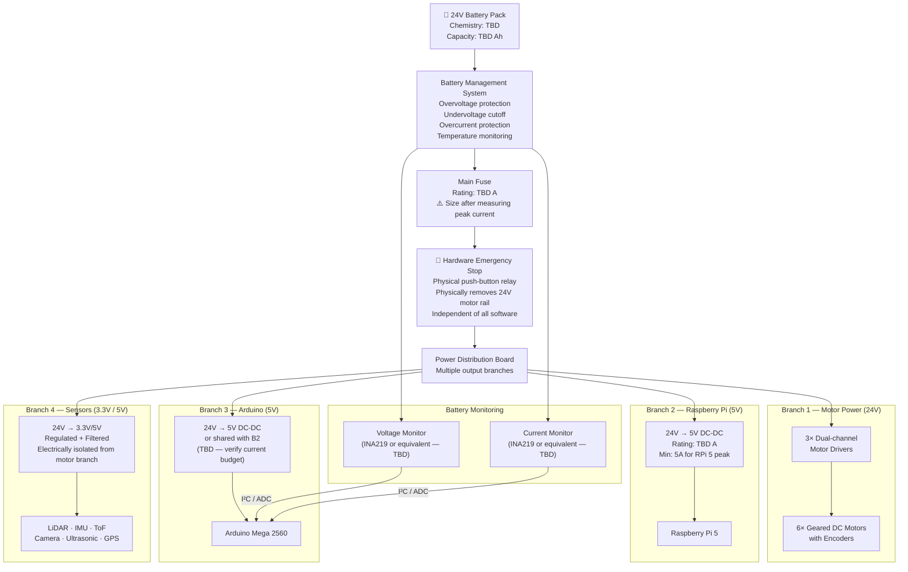
```mermaid
flowchart TD
    BAT["🔋 24V Battery Pack\nChemistry: TBD\nCapacity: TBD Ah"]

    BMS["Battery Management System\nOvervoltage protection\nUndervoltage cutoff\nOvercurrent protection\nTemperature monitoring"]

    FUSE["Main Fuse\nRating: TBD A\n⚠️ Size after measuring peak current"]

    ESTOP_HW["🔴 Hardware Emergency Stop\nPhysical push-button relay\nPhysically removes 24V motor rail\nIndependent of all software"]

    PDB["Power Distribution Board\nMultiple output branches"]

    subgraph B1["Branch 1 — Motor Power (24V)"]
        MD_PWR["3× Dual-channel\nMotor Drivers"]
        M6["6× Geared DC Motors\nwith Encoders"]
    end

    subgraph B2["Branch 2 — Raspberry Pi (5V)"]
        DCDC1["24V → 5V DC-DC\nRating: TBD A\nMin: 5A for RPi 5 peak"]
        RPI_PWR["Raspberry Pi 5"]
    end

    subgraph B3["Branch 3 — Arduino (5V)"]
        DCDC2["24V → 5V DC-DC\nor shared with B2\n(TBD — verify current budget)"]
        ARD_PWR["Arduino Mega 2560"]
    end

    subgraph B4["Branch 4 — Sensors (3.3V / 5V)"]
        DCDC3["24V → 3.3V/5V\nRegulated + Filtered\nElectrically isolated from motor branch"]
        SENS_PWR["LiDAR · IMU · ToF\nCamera · Ultrasonic · GPS"]
    end

    subgraph MON["Battery Monitoring"]
        VMON["Voltage Monitor\n(INA219 or equivalent — TBD)"]
        CMON["Current Monitor\n(INA219 or equivalent — TBD)"]
    end

    BAT --> BMS
    BMS --> VMON & CMON
    BMS --> FUSE
    FUSE --> ESTOP_HW
    ESTOP_HW --> PDB
    PDB --> MD_PWR --> M6
    PDB --> DCDC1 --> RPI_PWR
    PDB --> DCDC2 --> ARD_PWR
    PDB --> DCDC3 --> SENS_PWR
    VMON & CMON -->|"I²C / ADC"| ARD_PWR
```

### 8.2 Safety Separation Principle

```
HARDWARE E-STOP — WHAT IT GUARANTEES:
══════════════════════════════════════════════════════════

Operator presses physical E-Stop button
                  │
                  ▼
     Relay opens → 24V motor power rail CUT
                  │
                  ▼
     All 6 motors lose power IMMEDIATELY
     Motor drivers enter coast/brake state
                  │
                  ▼
     Raspberry Pi, Arduino, sensors: STILL POWERED
     (separate supply branches)

The hardware E-Stop is INDEPENDENT of:
  ✗ Raspberry Pi (crashed / rebooting / hung)
  ✗ ROS 2 (crashed / not running)
  ✗ Arduino firmware (hung / faulted)
  ✗ USB/UART communication (disconnected)
  ✗ Any software process or thread

══════════════════════════════════════════════════════════
```

### 8.3 Electrical Specification Notes

> **All values below are TBD. Do not use these before verifying on hardware:**
>
> - Main fuse rating (TBD A)
> - Wire gauge — motor power branch (TBD AWG)
> - Wire gauge — logic/sensor branch (TBD AWG)
> - DC-DC converter output current (TBD A per branch)
> - Motor driver continuous current per channel (TBD A)
> - Motor driver peak/stall current per channel (TBD A)
> - Motor rated voltage (TBD V)
> - Motor rated current (TBD A)
> - Motor stall current (TBD A) — **must be measured under load before selecting motor drivers**
> - Battery capacity (TBD Ah)
> - Battery discharge rate (TBD C)

**Sensor power quality requirement:** Sensor supply must be taken from a filtered, regulated converter, electrically isolated from the motor power branch. Motor switching transients must not contaminate sensor signal lines. Use decoupling capacitors (100 nF + 10 µF) near each sensor's power pins.

---

## 9. Dual-Processor Architecture

### 9.1 Responsibility Boundary


```mermaid
graph TD
    subgraph RPI_BOX["RASPBERRY PI 5 — THE BRAIN"]
        direction TB
        R1["ROS 2 middleware"]
        R2["LiDAR processing → /scan"]
        R3["Camera → object detection, marker detection"]
        R4["IMU data → /imu/data"]
        R5["ToF processing → /tof/*"]
        R6["GPS (optional) → /gps/fix"]
        R7["Sensor fusion (EKF)"]
        R8["Localization → /localization/pose"]
        R9["SLAM → /map"]
        R10["Global planner (A*) → /path"]
        R11["Local planner (DWA) → /cmd_vel"]
        R12["Obstacle avoidance decisions"]
        R13["Behavior manager"]
        R14["Mission manager"]
        R15["Parking logic"]
        R16["Recovery logic"]
        R17["Diagnostics and logging"]
        R18["High-level velocity commands → /cmd_vel"]
    end

    subgraph ARD_BOX["ARDUINO MEGA 2560 — THE REFLEXES"]
        direction TB
        A1["Receive /cmd_vel via serial"]
        A2["Convert to left/right wheel velocities"]
        A3["6× quadrature encoder reading"]
        A4["6× wheel speed calculation"]
        A5["6× closed-loop PID control"]
        A6["PWM generation (timer-based)"]
        A7["Direction signal output"]
        A8["Motor driver interface"]
        A9["Watchdog timer"]
        A10["Command timeout → zero PWM"]
        A11["Hardware E-stop status monitoring"]
        A12["Battery voltage / current reading (TBD)"]
        A13["Send odometry + status → Raspberry Pi"]
    end

    RPI_BOX -->|"/cmd_vel via USB/UART"| ARD_BOX
    ARD_BOX -->|"encoder data + status via USB/UART"| RPI_BOX
```

### 9.2 Why Two Processors?

| Requirement | Raspberry Pi (Linux) | Arduino Mega |
|---|---|---|
| Real-time motor PID at >500 Hz | ❌ Linux jitter prevents this | ✅ Deterministic loop |
| SLAM, A\*, ROS 2 | ✅ Full compute available | ❌ Insufficient memory |
| Encoder interrupt handling | ❌ GPIO interrupt latency variable | ✅ Hardware interrupts, µs latency |
| PWM generation (hardware timer) | ❌ Not available reliably on RPi | ✅ ATmega2560 hardware timers |
| Watchdog (if RPi hangs) | ❌ Cannot watch itself | ✅ Monitors serial timeout |
| AI inference, camera | ✅ ARM Cortex-A76 compute | ❌ Impossible on ATmega |

---

## 10. Communication Architecture

### 10.1 Communication Flow

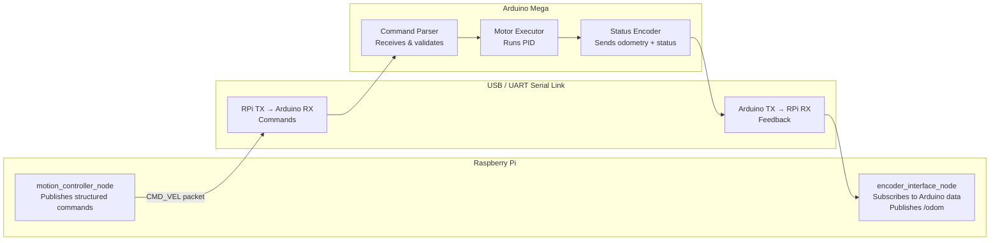
```mermaid
flowchart LR
    subgraph RPI_COMM["Raspberry Pi"]
        MC_NODE["motion_controller_node\nPublishes structured commands"]
        ENC_NODE["encoder_interface_node\nSubscribes to Arduino data\nPublishes /odom"]
    end

    subgraph LINK["USB / UART Serial Link"]
        TX_PI["RPi TX → Arduino RX\nCommands"]
        RX_PI["Arduino TX → RPi RX\nFeedback"]
    end

    subgraph ARD_COMM["Arduino Mega"]
        CMD_RECV["Command Parser\nReceives & validates"]
        STATUS_TX["Status Encoder\nSends odometry + status"]
        MOTOR_EXEC["Motor Executor\nRuns PID"]
    end

    MC_NODE -->|"CMD_VEL packet"| TX_PI
    TX_PI --> CMD_RECV --> MOTOR_EXEC
    MOTOR_EXEC --> STATUS_TX --> RX_PI --> ENC_NODE
```

### 10.2 Serial Communication Protocol (Planned)

**Raspberry Pi → Arduino (commands):**

```
# Velocity command
<CMD_VEL,linear_x,angular_z,seq,checksum\n>

# Arm motors
<ARM\n>

# Disarm motors (soft stop)
<DISARM\n>

# Immediate stop
<STOP\n>

# Reset fault state
<RESET\n>

# Heartbeat (sent periodically)
<PING\n>
```

**Arduino → Raspberry Pi (feedback):**

```
# Encoder odometry
<ENC,vl_left,vl_mid,vl_rear,vr_left,vr_mid,vr_rear,seq,checksum\n>

# Status packet
<STATUS,battery_mv,estop_state,motor_armed,watchdog_ok,seq\n>

# Fault report
<FAULT,fault_code,fault_description\n>

# Heartbeat response
<PONG\n>
```

**Protocol rules:**
- All messages are ASCII text delimited by `<` and `\n`
- Checksum: simple XOR of payload bytes (TBD — verify implementation)
- Arduino must respond to PING within TBD ms or Raspberry Pi raises communication fault
- If Arduino receives no CMD_VEL within watchdog timeout (TBD ms), it automatically sets all motor PWM to zero
- All numerical values use fixed decimal notation (e.g., `0.450`, `-0.230`)

> CAN bus is listed as a **future upgrade option** for noise immunity and multi-node expansion. It is not implemented in the current architecture.

---

## 11. ROS 2 Architecture

### 11.1 Node Graph

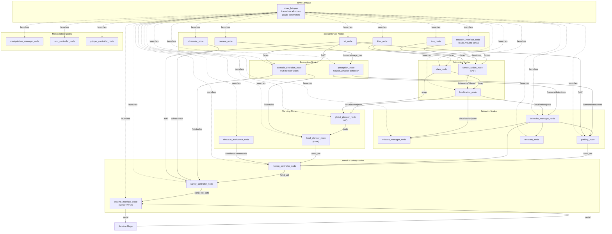
```mermaid
graph TD
    subgraph BRINGUP["rover_bringup"]
        BU_N["rover_bringup\nLaunches all nodes\nLoads parameters"]
    end

    subgraph DRIVERS_GRP["Sensor Driver Nodes"]
        LN["lidar_node"]
        CN["camera_node"]
        IN["imu_node"]
        TN["tof_node"]
        UN["ultrasonic_node"]
        EN["encoder_interface_node\n(reads Arduino serial)"]
    end

    subgraph PERCEPTION_GRP["Perception Nodes"]
        PERCN["perception_node\nObject & marker detection"]
        OBSN["obstacle_detection_node\nMulti-sensor fusion"]
    end

    subgraph FUSION_GRP["Estimation Nodes"]
        SFN["sensor_fusion_node\n(EKF)"]
        LOCN["localization_node"]
        SLAMN["slam_node"]
    end

    subgraph PLANNING_GRP["Planning Nodes"]
        GPN["global_planner_node\n(A*)"]
        LPN["local_planner_node\n(DWA)"]
        OAN["obstacle_avoidance_node"]
    end

    subgraph BEHAVIOR_GRP["Behavior Nodes"]
        BMN["behavior_manager_node"]
        MMN["mission_manager_node"]
        PKN["parking_node"]
        RCN["recovery_node"]
    end

    subgraph MANIPULATION_GRP["Manipulation Nodes"]
        ARMM["manipulation_manager_node"]
        ARMC["arm_controller_node"]
        GRPC["gripper_controller_node"]
    end

    subgraph CONTROL_GRP["Control & Safety Nodes"]
        MCN["motion_controller_node"]
        AIN["arduino_interface_node\n(serial TX/RX)"]
        SCN["safety_controller_node"]
    end

    BU_N -.->|launches| LN & CN & IN & TN & UN & EN
    BU_N -.->|launches| PERCN & OBSN
    BU_N -.->|launches| SFN & LOCN & SLAMN
    BU_N -.->|launches| GPN & LPN & OAN
    BU_N -.->|launches| BMN & MMN & PKN & RCN
    BU_N -.->|launches| ARMM & ARMC & GRPC
    BU_N -.->|launches| MCN & AIN & SCN

    LN -->|"/scan"| SFN & SLAMN & OBSN
    CN -->|"/camera/image_raw"| PERCN
    IN -->|"/imu/data"| SFN
    TN -->|"/tof/*"| OBSN & SCN & PKN
    UN -->|"/ultrasonic/*"| SCN
    EN -->|"/odom"| SFN

    SFN -->|"/odometry/filtered"| LOCN
    SLAMN -->|"/map"| GPN & LOCN
    LOCN -->|"/localization/pose"| GPN & BMN & MMN
    PERCN -->|"/camera/detections"| BMN & PKN
    OBSN -->|"/obstacles"| LPN & SCN
    OAN -->|avoidance commands| MCN
    GPN -->|"/path"| LPN
    LPN -->|"/cmd_vel"| MCN
    BMN --> MCN & PKN & RCN & MMN
    PKN -->|"/cmd_vel"| MCN
    MCN -->|"/cmd_vel"| SCN
    SCN -->|"/cmd_vel_safe"| AIN
    AIN -->|serial| ARDUINO_NODE["Arduino Mega"]
    ARDUINO_NODE -->|serial| AIN
```

---

## 12. ROS 2 Nodes

### `rover_bringup`
| Field | Detail |
|---|---|
| **Responsibility** | Top-level orchestrator. Loads all YAML parameters, launches all nodes, manages bring-up sequencing |
| **Inputs** | Launch arguments, YAML config files |
| **Outputs** | All ROS 2 nodes started |
| **Status** | 🟡 Planned |

### `lidar_node`
| Field | Detail |
|---|---|
| **Responsibility** | Drives 360° LiDAR over USB/UART. Publishes laser scan data |
| **Inputs** | LiDAR hardware data stream |
| **Outputs** | `/scan` — `sensor_msgs/LaserScan` |
| **Status** | 🟡 Planned |

### `camera_node`
| Field | Detail |
|---|---|
| **Responsibility** | Drives AI camera. Publishes raw image frames |
| **Inputs** | Camera hardware (CSI / USB) |
| **Outputs** | `/camera/image_raw` — `sensor_msgs/Image` |
| **Status** | 🟡 Planned |

### `imu_node`
| Field | Detail |
|---|---|
| **Responsibility** | Reads IMU (MPU-9250 / BNO085) over I²C/SPI. Publishes orientation and angular velocity |
| **Inputs** | IMU hardware |
| **Outputs** | `/imu/data` — `sensor_msgs/Imu` |
| **Status** | 🟡 Planned |

### `tof_node`
| Field | Detail |
|---|---|
| **Responsibility** | Reads three VL53L1X ToF sensors via I²C (XSHUT multiplexing). Publishes range distances |
| **Inputs** | I²C bus |
| **Outputs** | `/tof/front_left`, `/tof/front_center`, `/tof/front_right` — `sensor_msgs/Range` |
| **Status** | 🟡 Planned |

### `ultrasonic_node`
| Field | Detail |
|---|---|
| **Responsibility** | Reads two JSN-SR04T sensors. Publishes range distances |
| **Inputs** | GPIO Trig/Echo (Raspberry Pi or Arduino) |
| **Outputs** | `/ultrasonic/front`, `/ultrasonic/rear` — `sensor_msgs/Range` |
| **Notes** | If triggered from Arduino, data relayed via serial |
| **Status** | 🟡 Planned |

### `encoder_interface_node`
| Field | Detail |
|---|---|
| **Responsibility** | Reads encoder + status data from Arduino over serial. Computes and publishes raw odometry |
| **Inputs** | Serial data from Arduino Mega |
| **Outputs** | `/odom` — `nav_msgs/Odometry` |
| **Status** | 🟡 Planned |

### `perception_node`
| Field | Detail |
|---|---|
| **Responsibility** | Runs object detection and QR/ArUco marker detection on camera images |
| **Inputs** | `/camera/image_raw` |
| **Outputs** | `/camera/detections` — `vision_msgs/Detection2DArray` |
| **Status** | 🟡 Planned |

### `obstacle_detection_node`
| Field | Detail |
|---|---|
| **Responsibility** | Fuses LiDAR, ToF, and ultrasonic data into unified obstacle representation. Updates local costmap |
| **Inputs** | `/scan`, `/tof/*`, `/ultrasonic/*` |
| **Outputs** | `/obstacles`, costmap updates |
| **Status** | 🟡 Planned |

### `sensor_fusion_node`
| Field | Detail |
|---|---|
| **Responsibility** | Extended Kalman Filter fusing encoder odometry + IMU (+optional GPS). Produces filtered odometry |
| **Inputs** | `/odom`, `/imu/data`, `/gps/fix` (optional) |
| **Outputs** | `/odometry/filtered` — `nav_msgs/Odometry` |
| **Candidate package** | `robot_localization` (ekf_node) |
| **Status** | 🟡 Planned |

### `localization_node`
| Field | Detail |
|---|---|
| **Responsibility** | Maintains rover global pose estimate. Manages TF tree (map → odom → base_link) |
| **Inputs** | `/odometry/filtered`, `/map`, `/scan` |
| **Outputs** | `/localization/pose`, `/tf` |
| **Status** | 🟡 Planned |

### `slam_node`
| Field | Detail |
|---|---|
| **Responsibility** | Builds and updates occupancy grid map using 2D LiDAR. Provides robot pose within map |
| **Inputs** | `/scan`, `/odometry/filtered`, `/tf` |
| **Outputs** | `/map`, `/tf` (map→odom correction) |
| **Candidate package** | `slam_toolbox` |
| **Status** | 🟡 Planned |

### `global_planner_node`
| Field | Detail |
|---|---|
| **Responsibility** | Computes global path from current pose to goal using A\* on occupancy grid |
| **Inputs** | `/map`, `/localization/pose`, `/goal_pose` |
| **Outputs** | `/path` — `nav_msgs/Path` |
| **Status** | 🟡 Planned |

### `local_planner_node`
| Field | Detail |
|---|---|
| **Responsibility** | Generates safe velocity commands following global path while avoiding immediate obstacles |
| **Inputs** | `/path`, `/localization/pose`, `/obstacles`, local costmap |
| **Outputs** | `/cmd_vel` — `geometry_msgs/Twist` |
| **Status** | 🟡 Planned |

### `obstacle_avoidance_node`
| Field | Detail |
|---|---|
| **Responsibility** | Handles dynamic obstacle events: stop, wait, trigger replan |
| **Inputs** | `/obstacles`, `/localization/pose` |
| **Outputs** | Commands to behavior manager and motion controller |
| **Status** | 🟡 Planned |

### `behavior_manager_node`
| Field | Detail |
|---|---|
| **Responsibility** | Top-level behavior arbiter. Decides which module controls motion at any time |
| **Inputs** | All perception, localization, diagnostics |
| **Outputs** | Active mode, goal poses, recovery triggers |
| **Status** | 🟡 Planned |

### `manipulation_manager_node`
| Field | Detail |
|---|---|
| **Responsibility** | Coordinates arm sequence, object pickup and placement, verifies grip |
| **Inputs** | `/camera/detections`, `/localization/pose`, arm feedback |
| **Outputs** | Arm commands |
| **Status** | 🟡 Planned |

### `arm_controller_node`
| Field | Detail |
|---|---|
| **Responsibility** | Drives 4 DOF robotic arm |
| **Inputs** | Joint commands |
| **Outputs** | Arm state |
| **Status** | 🟡 Planned |

### `gripper_controller_node`
| Field | Detail |
|---|---|
| **Responsibility** | Drives robotic hand/gripper |
| **Inputs** | Grip commands |
| **Outputs** | Grip state, grip verification |
| **Status** | 🟡 Planned |

### `mission_manager_node`
| Field | Detail |
|---|---|
| **Responsibility** | Runs the competition round sequencer. Tracks lap count, assigns waypoints per round |
| **Inputs** | `/localization/pose`, lap completion events |
| **Outputs** | `/goal_pose` per round |
| **Status** | 🟡 Planned |

### `parking_node`
| Field | Detail |
|---|---|
| **Responsibility** | Executes dedicated parking state machine at mission end |
| **Inputs** | `/tof/*`, `/scan`, `/localization/pose`, `/camera/detections` |
| **Outputs** | `/cmd_vel` (low-speed parking commands) |
| **Status** | 🟡 Planned |

### `recovery_node`
| Field | Detail |
|---|---|
| **Responsibility** | Executes recovery behaviors when normal navigation fails |
| **Inputs** | Failure signals, sensor data, diagnostics |
| **Outputs** | Recovery motion commands |
| **Status** | 🟡 Planned |

### `motion_controller_node`
| Field | Detail |
|---|---|
| **Responsibility** | Translates `/cmd_vel` (Twist) to structured serial command for Arduino |
| **Inputs** | `/cmd_vel_safe` |
| **Outputs** | Serial packet to `arduino_interface_node` |
| **Status** | 🟡 Planned |

### `arduino_interface_node`
| Field | Detail |
|---|---|
| **Responsibility** | Manages USB/UART serial link to Arduino Mega. Sends commands, receives feedback |
| **Inputs** | Motion commands, Arduino serial stream |
| **Outputs** | `/odom`, `/diagnostics` (Arduino status) |
| **Status** | 🟡 Planned |

### `safety_controller_node`
| Field | Detail |
|---|---|
| **Responsibility** | Final velocity gate. Enforces limits, monitors timeouts, triggers software stop |
| **Inputs** | `/cmd_vel`, `/tof/*`, `/ultrasonic/*`, `/imu/data`, `/diagnostics` |
| **Outputs** | `/cmd_vel_safe`, `/emergency_stop` |
| **Status** | 🟡 Planned |

---

## 13. ROS 2 Topics

| Topic | Message Type | Publisher | Subscriber(s) | Purpose | Status |
|---|---|---|---|---|---|
| `/scan` | `sensor_msgs/LaserScan` | `lidar_node` | `slam_node`, `obstacle_detection_node`, `localization_node` | 360° laser scan | 🟡 Planned |
| `/camera/image_raw` | `sensor_msgs/Image` | `camera_node` | `perception_node` | Raw camera frames | 🟡 Planned |
| `/camera/detections` | `vision_msgs/Detection2DArray` | `perception_node` | `behavior_manager_node`, `parking_node` | Object and marker detections | 🟡 Planned |
| `/imu/data` | `sensor_msgs/Imu` | `imu_node` | `sensor_fusion_node` | IMU orientation, angular velocity | 🟡 Planned |
| `/tof/front_left` | `sensor_msgs/Range` | `tof_node` | `obstacle_detection_node`, `safety_controller_node`, `parking_node` | Left ToF range | 🟡 Planned |
| `/tof/front_center` | `sensor_msgs/Range` | `tof_node` | `obstacle_detection_node`, `safety_controller_node`, `parking_node` | Centre ToF range | 🟡 Planned |
| `/tof/front_right` | `sensor_msgs/Range` | `tof_node` | `obstacle_detection_node`, `safety_controller_node`, `parking_node` | Right ToF range | 🟡 Planned |
| `/ultrasonic/front` | `sensor_msgs/Range` | `ultrasonic_node` | `safety_controller_node` | Front ultrasonic range | 🟡 Planned |
| `/ultrasonic/rear` | `sensor_msgs/Range` | `ultrasonic_node` | `safety_controller_node` | Rear ultrasonic range | 🟡 Planned |
| `/gps/fix` | `sensor_msgs/NavSatFix` | `gps_node` | `sensor_fusion_node` | Optional GPS position | 🟡 Planned (optional) |
| `/odom` | `nav_msgs/Odometry` | `encoder_interface_node` | `sensor_fusion_node` | Raw encoder odometry | 🟡 Planned |
| `/odometry/filtered` | `nav_msgs/Odometry` | `sensor_fusion_node` | `localization_node`, `slam_node` | EKF-fused odometry | 🟡 Planned |
| `/tf` | `tf2_msgs/TFMessage` | Multiple nodes | All transform consumers | Dynamic transforms | 🟡 Planned |
| `/tf_static` | `tf2_msgs/TFMessage` | `rover_bringup` | All | Static sensor transforms | 🟡 Planned |
| `/map` | `nav_msgs/OccupancyGrid` | `slam_node` | `global_planner_node`, `localization_node` | Occupancy grid map | 🟡 Planned |
| `/map_updates` | `map_msgs/OccupancyGridUpdate` | `slam_node` | `global_planner_node` | Incremental map updates | 🟡 Planned |
| `/localization/pose` | `geometry_msgs/PoseWithCovarianceStamped` | `localization_node` | `global_planner_node`, `behavior_manager_node`, `parking_node` | Best rover pose estimate | 🟡 Planned |
| `/goal_pose` | `geometry_msgs/PoseStamped` | `mission_manager_node` | `global_planner_node` | Current navigation goal | 🟡 Planned |
| `/path` | `nav_msgs/Path` | `global_planner_node` | `local_planner_node` | Global planned path | 🟡 Planned |
| `/obstacles` | `visualization_msgs/MarkerArray` | `obstacle_detection_node` | `local_planner_node`, `behavior_manager_node` | Fused obstacle positions | 🟡 Planned |
| `/cmd_vel` | `geometry_msgs/Twist` | `local_planner_node`, `parking_node` | `safety_controller_node` | Desired velocity | 🟡 Planned |
| `/cmd_vel_safe` | `geometry_msgs/Twist` | `safety_controller_node` | `arduino_interface_node` | Safety-validated velocity | 🟡 Planned |
| `/emergency_stop` | `std_msgs/Bool` | `safety_controller_node` | `arduino_interface_node`, `behavior_manager_node` | Software E-stop flag | 🟡 Planned |
| `/diagnostics` | `diagnostic_msgs/DiagnosticArray` | Multiple | `behavior_manager_node`, `safety_controller_node` | System health | 🟡 Planned |
| `/battery/status` | `sensor_msgs/BatteryState` | `arduino_interface_node` | `behavior_manager_node`, `safety_controller_node` | Battery voltage, current, SoC | 🟡 Planned |

---

## 14. Sensor Fusion

### 14.1 Purpose

Sensor fusion combines multiple imperfect sensor sources into a **single, stable, drift-corrected pose estimate** that is more reliable than any individual sensor.

| Sensor | Contribution | Known Weakness |
|---|---|---|
| **Wheel encoders** | Incremental position and velocity. Accurate at short range | Drift accumulates. Wheel slip degrades accuracy |
| **IMU** | Orientation (yaw, pitch, roll), angular velocity. High frequency, fast response | Gyro drift over time. Accelerometer noise |
| **LiDAR** | Geometric environment matching. Corrects position against map features | Computationally heavy. Fails in featureless areas |
| **GPS** | Global coordinate reference | ~1–3 m accuracy. Too imprecise for fine parking |

### 14.2 EKF Fusion Architecture (Planned)

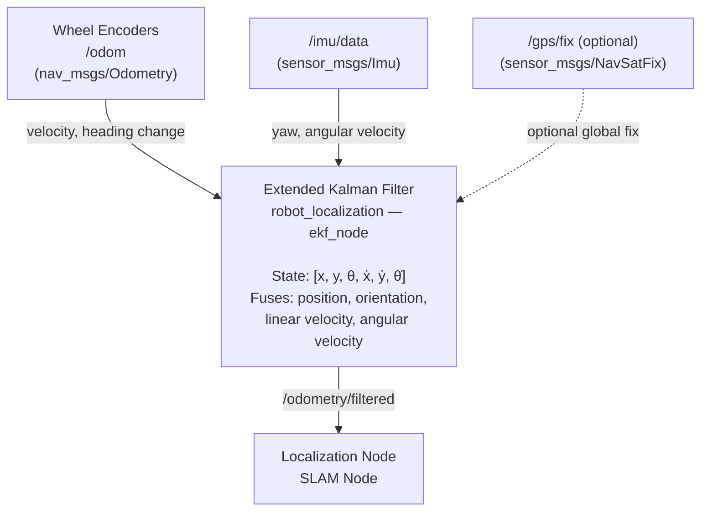
```mermaid
flowchart TD
    ENC_SF["Wheel Encoders\n/odom\n(nav_msgs/Odometry)"]
    IMU_SF["/imu/data\n(sensor_msgs/Imu)"]
    GPS_SF["/gps/fix (optional)\n(sensor_msgs/NavSatFix)"]

    EKF_N["Extended Kalman Filter\nrobot_localization — ekf_node\n\nState: [x, y, θ, ẋ, ẏ, θ̇]\nFuses: position, orientation,\nlinear velocity, angular velocity"]

    ENC_SF -->|"velocity, heading change"| EKF_N
    IMU_SF -->|"yaw, angular velocity"| EKF_N
    GPS_SF -.->|"optional global fix"| EKF_N
    EKF_N -->|"/odometry/filtered"| OUT_SF["Localization Node\nSLAM Node"]
```

**EKF State vector:**

```
State = [x, y, θ, ẋ, ẏ, θ̇]

  x, y = position in odometry frame
  θ    = heading (yaw)
  ẋ, ẏ = linear velocities
  θ̇   = angular velocity
```

**Planned configuration** (`robot_localization` ekf_node):

```yaml
# config/ekf_params.yaml — Planned
ekf_node:
  frequency: 50.0
  two_d_mode: true
  sensor_timeout: 0.1

  odom0: /odom
  odom0_config: [true,  true,  false,   # x, y, z
                 false, false, true,    # roll, pitch, yaw
                 true,  true,  false,   # vx, vy, vz
                 false, false, true,    # vroll, vpitch, vyaw
                 false, false, false]   # ax, ay, az

  imu0: /imu/data
  imu0_config: [false, false, false,
                false, false, true,    # yaw from IMU
                false, false, false,
                false, false, true,    # angular velocity from IMU
                false, false, false]
```

> Values shown are illustrative. Must be tuned after hardware bring-up.

---

## 15. Localization

### 15.1 Two Localization Modes

#### Mode A — Known Map (Preferred for Fixed Competition Track)

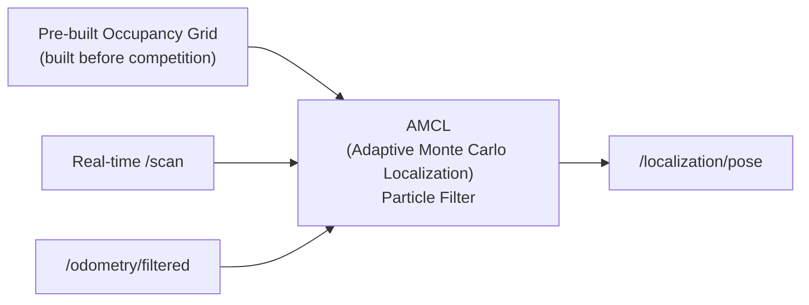
```mermaid
flowchart LR
    PMAP["Pre-built Occupancy Grid\n(built before competition)"]
    SCAN_LOC["Real-time /scan"]
    ODOM_LOC["/odometry/filtered"]
    AMCL_N["AMCL\n(Adaptive Monte Carlo Localization)\nParticle Filter"]
    POSE_OUT["/localization/pose"]

    PMAP --> AMCL_N
    SCAN_LOC --> AMCL_N
    ODOM_LOC --> AMCL_N
    AMCL_N --> POSE_OUT
```

**Recommended for ROBOFEST** when the competition track geometry is fixed and known.

**Advantage:** Deterministic, repeatable, lower CPU load, no risk of SLAM divergence during the run.
**Requirement:** Build a complete, high-quality map of the track before competition day.

#### Mode B — Online SLAM (Unknown Environment)

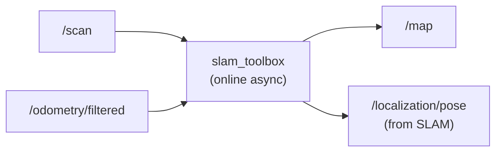
```mermaid
flowchart LR
    SCAN_SL["/scan"]
    ODOM_SL["/odometry/filtered"]
    SLAM_N2["slam_toolbox\n(online async)"]
    MAP_OUT["/map"]
    POSE_SL["/localization/pose\n(from SLAM)"]

    SCAN_SL --> SLAM_N2
    ODOM_SL --> SLAM_N2
    SLAM_N2 --> MAP_OUT & POSE_SL
```

Use when environment is unknown or map cannot be pre-built.

> **Recommendation:** For a fixed ROBOFEST competition course, **Mode A is significantly more reliable** than online SLAM during competition runs. Use SLAM in Mode B only to build the initial map, then switch to Mode A for competition.

---

## 16. SLAM

### 16.1 What Is SLAM?

**SLAM = Simultaneous Localization and Mapping.**

The rover must solve two interdependent problems simultaneously:
1. **Mapping** — build a model of the environment
2. **Localization** — determine position within that model

Each requires the other. SLAM solves both concurrently using probabilistic methods.

### 16.2 SLAM Data Flow

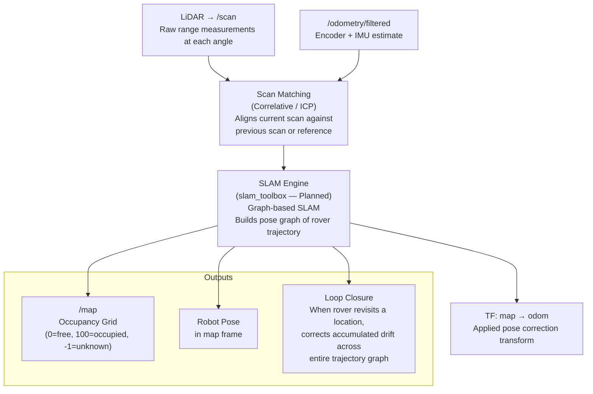
```mermaid
flowchart TD
    L_SLAM["LiDAR → /scan\nRaw range measurements at each angle"]
    O_SLAM["/odometry/filtered\nEncoder + IMU estimate"]

    SM_SLAM["Scan Matching\n(Correlative / ICP)\nAligns current scan against\nprevious scan or reference"]

    SLAM_ENG["SLAM Engine\n(slam_toolbox — Planned)\nGraph-based SLAM\nBuilds pose graph of rover trajectory"]

    subgraph SLAM_OUT["Outputs"]
        MAP_SLAM["/map\nOccupancy Grid\n(0=free, 100=occupied, -1=unknown)"]
        POSE_SL2["Robot Pose\nin map frame"]
        LC_N["Loop Closure\nWhen rover revisits a location,\ncorrects accumulated drift across\nentire trajectory graph"]
    end

    TF_SLAM["TF: map → odom\nApplied pose correction transform"]

    L_SLAM --> SM_SLAM
    O_SLAM --> SM_SLAM
    SM_SLAM --> SLAM_ENG
    SLAM_ENG --> MAP_SLAM & POSE_SL2 & LC_N & TF_SLAM
```

### 16.3 TF Tree

```
map
 └── odom              ← corrected by SLAM / AMCL
      └── base_link    ← propagated by encoder odometry
           ├── lidar_link
           ├── camera_link
           ├── imu_link
           ├── tof_front_left_link
           ├── tof_front_center_link
           ├── tof_front_right_link
           ├── ultrasonic_front_link
           └── ultrasonic_rear_link
```

> All static transforms (sensor positions relative to base_link) must be measured from the physical chassis and entered into URDF/TF static publishers before navigation testing.

---

## 17. Global Path Planning — A*

### 17.1 Algorithm Overview

Global planning finds the **optimal or near-optimal path** from the rover's current pose to the goal through a 2D occupancy grid.

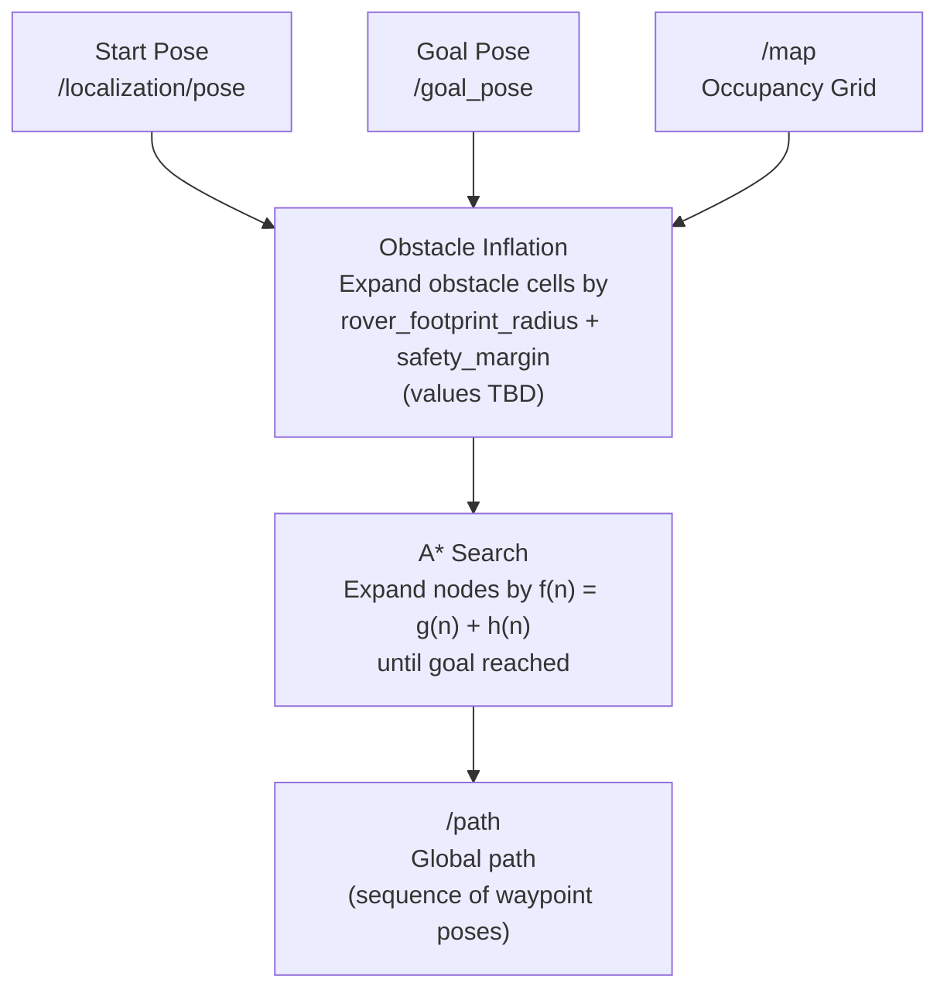
```mermaid
flowchart TD
    START_N["Start Pose\n/localization/pose"]
    GOAL_N["Goal Pose\n/goal_pose"]
    MAP_N["/map\nOccupancy Grid"]

    INFLATE["Obstacle Inflation\nExpand obstacle cells by\nrover_footprint_radius + safety_margin\n(values TBD)"]

    ASTAR_N["A* Search\nExpand nodes by f(n) = g(n) + h(n)\nuntil goal reached"]

    PATH_OUT2["/path\nGlobal path\n(sequence of waypoint poses)"]

    START_N & GOAL_N & MAP_N --> INFLATE --> ASTAR_N --> PATH_OUT2
```

### 17.2 A* Cost Function

```
f(n) = g(n) + h(n)

  g(n) = true cost from start to node n
         (path length + obstacle proximity penalty)

  h(n) = heuristic estimated cost from n to goal
         (Euclidean distance: h = sqrt(Δx² + Δy²))

  f(n) = total estimated path cost through node n
```

**Grid cell classification:**

| Cell value | Meaning | Traversable |
|---|---|---|
| 0 | Free space | Yes (cost = base cost) |
| 1–99 | Inflation zone | Yes (cost increases near obstacles) |
| 100 | Occupied | No |
| -1 | Unknown | Configurable (treat as obstacle by default) |

**Inflation radius:** `rover_footprint_radius + safety_margin` — exact values TBD.

> **Planned implementation:** Nav2 `planner_server` with `SmacPlanner2D` (A\*-based) or `NavFn` plugin.

---

## 18. Local Path Planning — DWA

### 18.1 Role of the Local Planner

The global planner assumes a static map. The local planner handles **real-time deviations** caused by dynamic obstacles or localization drift, generating safe velocity commands within a short forward horizon.

### 18.2 DWA Flow

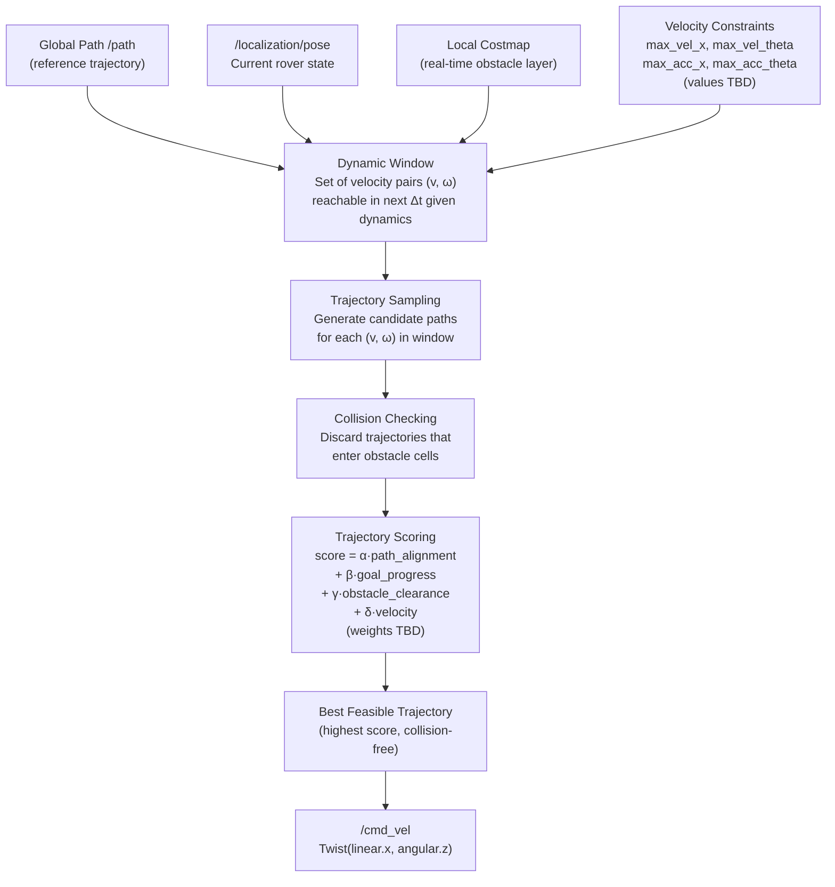
```mermaid
flowchart TD
    GP_IN["Global Path /path\n(reference trajectory)"]
    POSE_IN["/localization/pose\nCurrent rover state"]
    LC_IN["Local Costmap\n(real-time obstacle layer)"]
    VEL_C["Velocity Constraints\nmax_vel_x, max_vel_theta\nmax_acc_x, max_acc_theta\n(values TBD)"]

    DW_SET["Dynamic Window\nSet of velocity pairs (v, ω)\nreachable in next Δt given dynamics"]

    TRAJ_SAMP["Trajectory Sampling\nGenerate candidate paths\nfor each (v, ω) in window"]

    COLL_CHK["Collision Checking\nDiscard trajectories that\nenter obstacle cells"]

    SCORE_N["Trajectory Scoring\nscore = α·path_alignment\n      + β·goal_progress\n      + γ·obstacle_clearance\n      + δ·velocity\n(weights TBD)"]

    BEST_TRAJ["Best Feasible Trajectory\n(highest score, collision-free)"]

    CMD_OUT["/cmd_vel\nTwist(linear.x, angular.z)"]

    GP_IN & POSE_IN & LC_IN & VEL_C --> DW_SET
    DW_SET --> TRAJ_SAMP --> COLL_CHK --> SCORE_N --> BEST_TRAJ --> CMD_OUT
```

> **Candidate local planner:** DWA via Nav2 `controller_server` (DWBLocalPlanner or RPP plugin).
> Implementation status: 🟡 Planned / To Be Verified.

---

## 19. Obstacle Detection

### 19.1 Layered Detection System

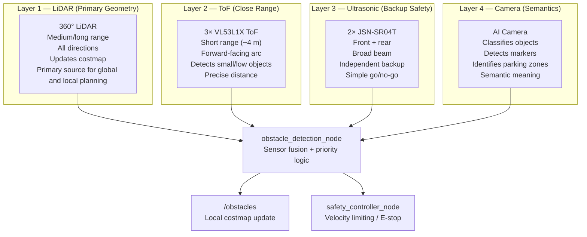
```mermaid
flowchart TD
    subgraph LAYER1["Layer 1 — LiDAR (Primary Geometry)"]
        L_OD["360° LiDAR\nMedium/long range\nAll directions\nUpdates costmap\nPrimary source for global and local planning"]
    end
    subgraph LAYER2["Layer 2 — ToF (Close Range)"]
        T_OD["3× VL53L1X ToF\nShort range (~4 m)\nForward-facing arc\nDetects small/low objects\nPrecise distance"]
    end
    subgraph LAYER3["Layer 3 — Ultrasonic (Backup Safety)"]
        U_OD["2× JSN-SR04T\nFront + rear\nBroad beam\nIndependent backup\nSimple go/no-go"]
    end
    subgraph LAYER4["Layer 4 — Camera (Semantics)"]
        C_OD["AI Camera\nClassifies objects\nDetects markers\nIdentifies parking zones\nSemantic meaning"]
    end

    L_OD & T_OD & U_OD & C_OD --> FUSE_OD["obstacle_detection_node\nSensor fusion + priority logic"]
    FUSE_OD --> COST_OD["/obstacles\nLocal costmap update"]
    FUSE_OD --> SC_OD["safety_controller_node\nVelocity limiting / E-stop"]
```

### 19.2 Sensor Priority

| Priority | Sensor | Action triggered |
|---|---|---|
| 1 (highest) | Ultrasonic (critical zone) | Immediate motor stop |
| 2 | ToF (critical zone) | Immediate motor stop |
| 3 | LiDAR (danger zone) | Decelerate + local replan |
| 4 | LiDAR (warning zone) | Monitor, prepare replan |
| 5 | Camera | Semantic classification, marker decisions |

---

## 20. Small Object Detection

### 20.1 The LiDAR Blind Spot Problem

A 2D LiDAR scans at a single horizontal plane at a fixed height above the ground. Objects that are shorter than the LiDAR mounting height — such as small cones, low curbs, ground-level markers, or debris — will pass beneath the scan plane and will not be detected.

This is a **critical safety gap** in competitions that include low-profile obstacles.

### 20.2 Multi-Sensor Compensation

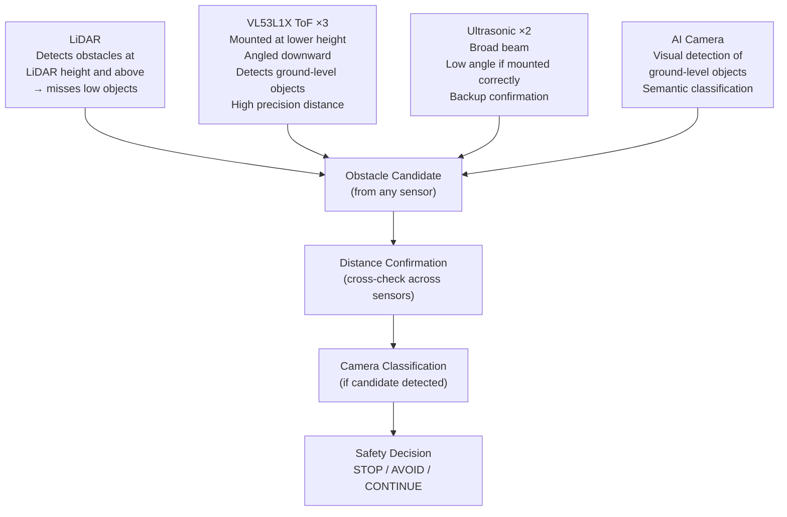
```mermaid
flowchart TD
    L_SO["LiDAR\nDetects obstacles at\nLiDAR height and above\n→ misses low objects"]
    T_SO["VL53L1X ToF ×3\nMounted at lower height\nAngled downward\nDetects ground-level objects\nHigh precision distance"]
    U_SO["Ultrasonic ×2\nBroad beam\nLow angle if mounted correctly\nBackup confirmation"]
    C_SO["AI Camera\nVisual detection of\nground-level objects\nSemantic classification"]

    CAND["Obstacle Candidate\n(from any sensor)"]
    DIST["Distance Confirmation\n(cross-check across sensors)"]
    CLASS["Camera Classification\n(if candidate detected)"]
    DEC["Safety Decision\nSTOP / AVOID / CONTINUE"]

    L_SO & T_SO & U_SO & C_SO --> CAND
    CAND --> DIST --> CLASS --> DEC
```

> Using ToF + camera in addition to LiDAR **reduces the probability of missing small ground-level obstacles**. It does not guarantee perfect detection under all conditions (object material, surface reflection, lighting).

---

## 21. Dynamic Obstacle Handling

### 21.1 Background

ROBOFEST competition documentation describes dynamic obstacles — moving obstacles that enter the rover's path. The rover must detect these, stop or slow down, wait for the path to clear, and resume navigation.

### 21.2 Dynamic Obstacle State Machine

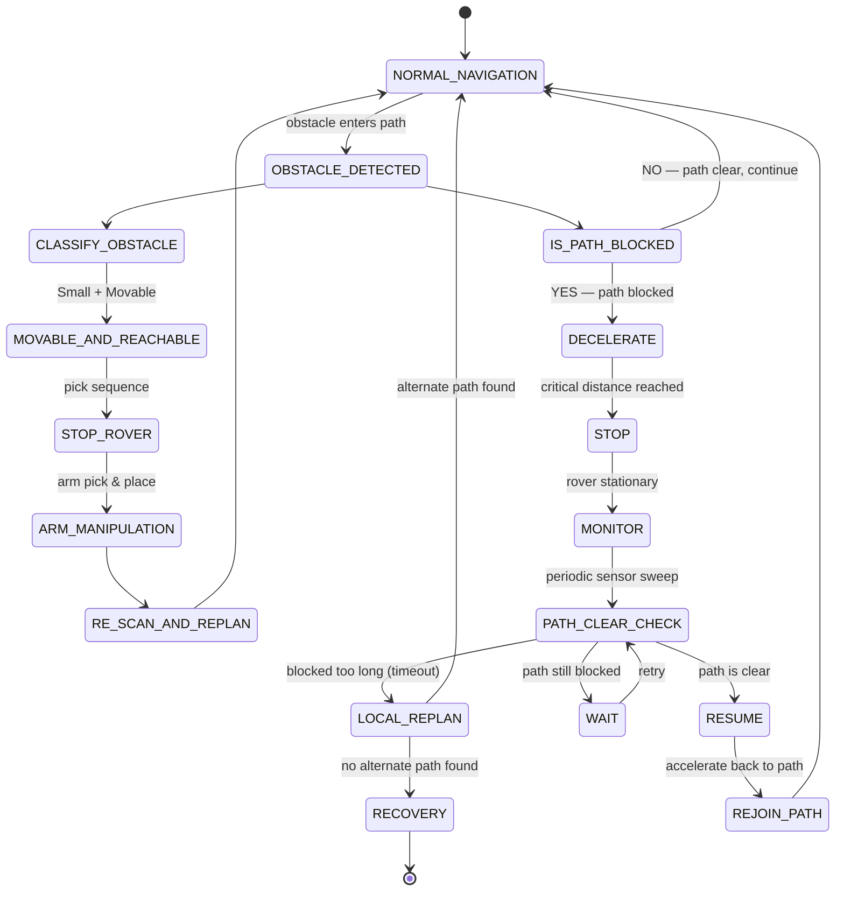
```mermaid
stateDiagram-v2
    [*] --> NORMAL_NAVIGATION

    NORMAL_NAVIGATION --> OBSTACLE_DETECTED : obstacle enters path

    OBSTACLE_DETECTED --> IS_PATH_BLOCKED
    OBSTACLE_DETECTED --> CLASSIFY_OBSTACLE

    CLASSIFY_OBSTACLE --> MOVABLE_AND_REACHABLE : Small + Movable
    MOVABLE_AND_REACHABLE --> STOP_ROVER : pick sequence
    STOP_ROVER --> ARM_MANIPULATION : arm pick & place
    ARM_MANIPULATION --> RE_SCAN_AND_REPLAN
    RE_SCAN_AND_REPLAN --> NORMAL_NAVIGATION

    IS_PATH_BLOCKED --> DECELERATE : YES — path blocked
    IS_PATH_BLOCKED --> NORMAL_NAVIGATION : NO — path clear, continue

    DECELERATE --> STOP : critical distance reached

    STOP --> MONITOR : rover stationary

    MONITOR --> PATH_CLEAR_CHECK : periodic sensor sweep

    PATH_CLEAR_CHECK --> RESUME : path is clear
    PATH_CLEAR_CHECK --> WAIT : path still blocked
    PATH_CLEAR_CHECK --> LOCAL_REPLAN : blocked too long (timeout)

    WAIT --> PATH_CLEAR_CHECK : retry

    LOCAL_REPLAN --> NORMAL_NAVIGATION : alternate path found
    LOCAL_REPLAN --> RECOVERY : no alternate path found

    RESUME --> REJOIN_PATH : accelerate back to path
    REJOIN_PATH --> NORMAL_NAVIGATION

    RECOVERY --> [*]
```

### 21.3 Replan vs Wait Decision

| Condition | Decision |
|---|---|
| Obstacle detected, path temporarily blocked | Stop and wait |
| Wait time < `wait_timeout` (TBD s) | Continue waiting |
| Wait time ≥ `wait_timeout` | Trigger local replan |
| Local replan finds path | Execute alternate path |
| Local replan fails | Trigger recovery |

### 21.4 Robotic Arm & Movable Obstacle Workflow

When a small, movable obstacle blocks the rover's path, the `manipulation_manager_node` executes the following sequence:

1. **Classify**: The obstacle is identified as small, movable, and within the arm's safe operating envelope.
2. **Stop**: The rover halts navigation and maintains a stationary, safe pose.
3. **Pre-Pick**: The 4-DOF arm moves from the `STOW` position to the `PRE_PICK` position above the object.
4. **Grip**: The arm lowers, and the `gripper_controller_node` actuates to grasp the object. Grip verification occurs.
5. **Move Aside**: The arm lifts the object and rotates to a safe side position outside the rover's path.
6. **Release**: The gripper opens to drop the object.
7. **Stow**: The arm returns to the secure `STOW` position.
8. **Resume**: The `mission_manager_node` is signaled to resume autonomous navigation.

> **Safety Rule**: The rover must be completely stationary before any arm manipulation begins. The arm will NOT perform a pick/place action while the rover is driving.

---

## 22. Motion Control

### 22.1 Differential Velocity Conversion

The Arduino receives `(linear_x, angular_z)` from the Raspberry Pi and converts it to individual wheel group velocities:

```
V_left  = linear_x - (angular_z × track_width / 2)
V_right = linear_x + (angular_z × track_width / 2)

track_width = distance between left and right wheel centrelines (TBD m)
```

Each side's velocity is then distributed equally to the three wheels on that side:

```
V_left_front = V_left_mid = V_left_rear = V_left
V_right_front = V_right_mid = V_right_rear = V_right
```

### 22.2 Motion Modes

| Mode | `linear_x` | `angular_z` | Left wheels | Right wheels |
|---|---|---|---|---|
| Forward | + | 0 | + | + |
| Reverse | − | 0 | − | − |
| Turn left | + | + | slower | faster |
| Turn right | + | − | faster | slower |
| Rotate CCW | 0 | + | − | + |
| Rotate CW | 0 | − | + | − |
| Stop | 0 | 0 | 0 | 0 |

---

## 23. Wheel PID

### 23.1 Closed-Loop Motor Control (Arduino)

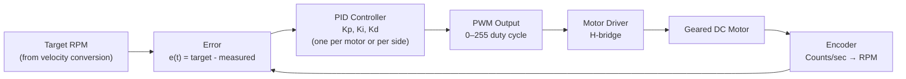
```mermaid
flowchart LR
    TGT["Target RPM\n(from velocity conversion)"]
    ERR["Error\ne(t) = target - measured"]
    PID_N["PID Controller\nKp, Ki, Kd\n(one per motor or per side)"]
    PWM_N["PWM Output\n0–255 duty cycle"]
    MDRV["Motor Driver\nH-bridge"]
    MTR["Geared DC Motor"]
    ENC_PID["Encoder\nCounts/sec → RPM"]

    TGT --> ERR
    ENC_PID --> ERR
    ERR --> PID_N --> PWM_N --> MDRV --> MTR --> ENC_PID
```

**PID control equation:**

```
u(t) = Kp·e(t)  +  Ki·∫e(t)dt  +  Kd·(de/dt)

  u(t) = PWM duty cycle (control output)
  e(t) = target_RPM − measured_RPM
  Kp   = proportional gain  (responds to current error magnitude)
  Ki   = integral gain      (eliminates steady-state offset)
  Kd   = derivative gain    (dampens oscillation)
```

**Discrete implementation (Arduino):**

```cpp
// Planned pseudocode — Arduino Mega
float error      = target_rpm - measured_rpm;
integral        += error * dt;
float derivative = (error - prev_error) / dt;
float output     = Kp * error + Ki * integral + Kd * derivative;
output           = constrain(output, -255, 255);
prev_error       = error;
// Apply output to PWM and direction pin
```

> **Kp, Ki, Kd are calibration parameters.** They must be tuned experimentally on the physical rover. Do not use values from other projects without validation. Expected tuning approach: Ziegler-Nichols method or manual step-response tuning.

---

## 24. Heading Control

### 24.1 IMU + Encoder Heading Correction

Open-loop differential steering cannot guarantee straight-line travel due to motor variation, surface friction asymmetry, and load changes. Heading control actively corrects heading error using IMU + EKF yaw feedback.

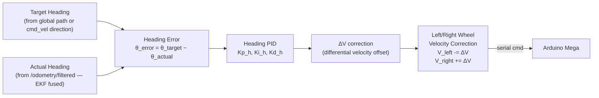
```mermaid
flowchart LR
    TGT_H["Target Heading\n(from global path or cmd_vel direction)"]
    ACT_H["Actual Heading\n(from /odometry/filtered — EKF fused)"]
    H_ERR["Heading Error\nθ_error = θ_target − θ_actual"]
    H_PID["Heading PID\nKp_h, Ki_h, Kd_h"]
    DV["ΔV correction\n(differential velocity offset)"]
    WHEELS_H["Left/Right Wheel\nVelocity Correction\nV_left  -= ΔV\nV_right += ΔV"]

    TGT_H & ACT_H --> H_ERR --> H_PID --> DV --> WHEELS_H
    WHEELS_H -->|"serial cmd"| ARDUINO_H["Arduino Mega"]
```

**Control law:**

```
ΔV = Kp_h·θ_error + Ki_h·∫θ_error dt

V_left_corrected  = V_left_nominal  − ΔV
V_right_corrected = V_right_nominal + ΔV
```

This continuously corrects drift from the intended heading while driving forward.

---

## 25. Parking Algorithm

### 25.1 Parking State Machine

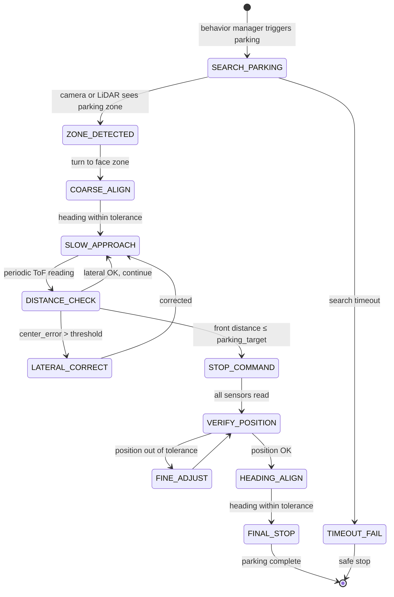
```mermaid
stateDiagram-v2
    [*] --> SEARCH_PARKING : behavior manager triggers parking

    SEARCH_PARKING --> ZONE_DETECTED : camera or LiDAR sees parking zone
    SEARCH_PARKING --> TIMEOUT_FAIL : search timeout

    ZONE_DETECTED --> COARSE_ALIGN : turn to face zone
    COARSE_ALIGN --> SLOW_APPROACH : heading within tolerance

    SLOW_APPROACH --> DISTANCE_CHECK : periodic ToF reading
    DISTANCE_CHECK --> LATERAL_CORRECT : center_error > threshold
    DISTANCE_CHECK --> SLOW_APPROACH : lateral OK, continue
    DISTANCE_CHECK --> STOP_COMMAND : front distance ≤ parking_target

    LATERAL_CORRECT --> SLOW_APPROACH : corrected

    STOP_COMMAND --> VERIFY_POSITION : all sensors read
    VERIFY_POSITION --> FINE_ADJUST : position out of tolerance
    VERIFY_POSITION --> HEADING_ALIGN : position OK
    FINE_ADJUST --> VERIFY_POSITION

    HEADING_ALIGN --> FINAL_STOP : heading within tolerance
    FINAL_STOP --> [*] : parking complete
    TIMEOUT_FAIL --> [*] : safe stop
```

### 25.2 Lateral Alignment

```
Three forward-facing ToF sensors:

[ToF Left]    [ToF Center]    [ToF Right]
     d_L            d_C            d_R

center_error = d_L − d_R

  center_error > +threshold → rover too far right → steer left
  center_error < −threshold → rover too far left  → steer right
  |center_error| ≤ threshold → centred → proceed forward
```

### 25.3 Approach Distance Control

```
d_front = ToF Center reading

While d_front > parking_target_distance:
    V_approach = min(V_max_park, Kp_park × (d_front − parking_target))
    Apply heading correction simultaneously

When d_front ≤ parking_target_distance:
    Send STOP command
```

> All parking parameters (`parking_target_distance`, `center_error_threshold`, `V_max_park`, `Kp_park`) are YAML-configurable. Values TBD — must be tuned experimentally.

---

## 26. Recovery System

### 26.1 Recovery State Machine

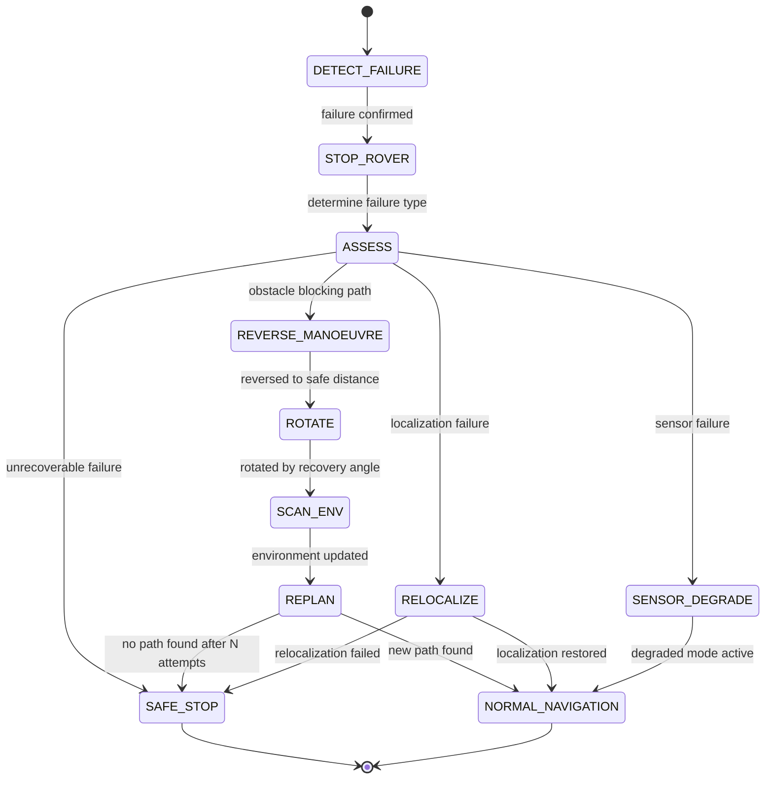
```mermaid
stateDiagram-v2
    [*] --> DETECT_FAILURE

    DETECT_FAILURE --> STOP_ROVER : failure confirmed

    STOP_ROVER --> ASSESS : determine failure type

    ASSESS --> REVERSE_MANOEUVRE : obstacle blocking path
    ASSESS --> RELOCALIZE : localization failure
    ASSESS --> SENSOR_DEGRADE : sensor failure
    ASSESS --> SAFE_STOP : unrecoverable failure

    REVERSE_MANOEUVRE --> ROTATE : reversed to safe distance
    ROTATE --> SCAN_ENV : rotated by recovery angle
    SCAN_ENV --> REPLAN : environment updated
    REPLAN --> NORMAL_NAVIGATION : new path found
    REPLAN --> SAFE_STOP : no path found after N attempts

    RELOCALIZE --> NORMAL_NAVIGATION : localization restored
    RELOCALIZE --> SAFE_STOP : relocalization failed

    SENSOR_DEGRADE --> NORMAL_NAVIGATION : degraded mode active
    SAFE_STOP --> [*]
    NORMAL_NAVIGATION --> [*]
```

### 26.2 Recovery Response Table

| Failure | Detection | Immediate Action | Recovery | Final Safe State |
|---|---|---|---|---|
| Static obstacle blocking path | LiDAR + obstacle_detection | Stop | Reverse → Rotate → Replan | Safe stop if N retries fail |
| Dynamic obstacle blocking | LiDAR + ToF | Stop + wait | Wait → Resume or replan | Continue if path clears |
| Rover stuck / wheel slip | Encoder velocity ≠ cmd_vel | Stop PWM | Reverse, retry, reduce speed | Stop after N failures |
| Localization diverged | Pose covariance > threshold | Slow to stop | Attempt AMCL relocalization | Safe stop |
| LiDAR failure | `/diagnostics` timeout | Reduce speed | Switch to ToF+US only mode | Slow minimum-speed mode |
| Camera failure | `/diagnostics` timeout | Disable semantic detection | Continue without camera data | Continue with reduced perception |
| IMU failure | `/diagnostics` timeout | Use encoder odometry only | Increase heading PID | Reduced heading accuracy |
| Encoder failure (1 wheel) | Arduino fault report | Reduce that motor PWM | Limp-home (5-wheel mode) | Finish round if possible |
| Arduino serial timeout | Serial watchdog on RPi | Publish `/emergency_stop` | Attempt reconnect | Hardware E-stop |
| Excessive tilt | IMU roll/pitch > threshold | Stop immediately | Do not move until tilt resolved | Wait for operator |
| Low battery | Battery monitor | Reduce speed + warn | Return to start if possible | Stop |
| Critical battery | Battery monitor | Immediate stop | Lock motors | Hardware E-stop |
| Motor driver fault | Arduino fault packet | Disable that driver | Stop affected wheel pair | Limp-home or stop |
| Planner failure | No `/path` within timeout | Stop rover | Trigger recovery → replan | Safe stop |

---

## 27. Mission State Machine

### 27.1 Competition Mission Flow

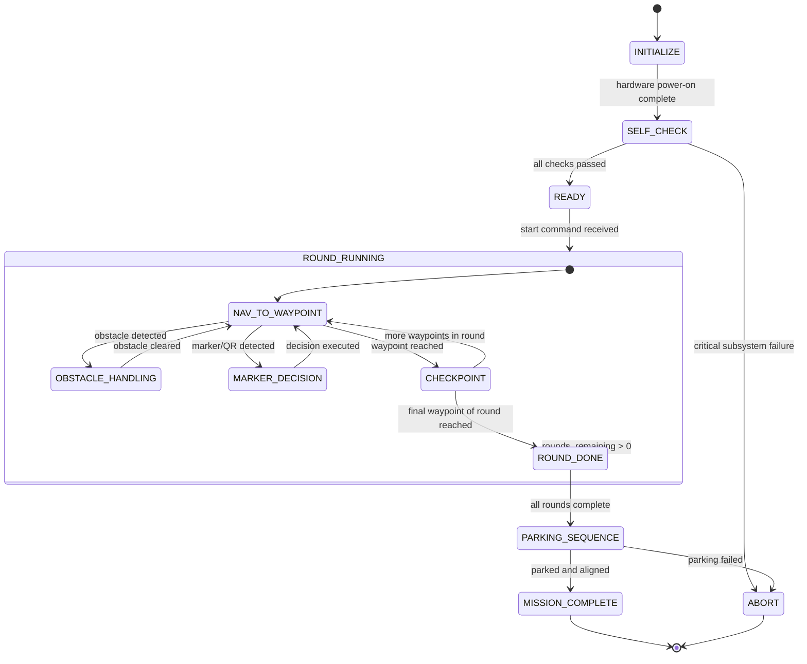
```mermaid
stateDiagram-v2
    [*] --> INITIALIZE

    INITIALIZE --> SELF_CHECK : hardware power-on complete
    SELF_CHECK --> ABORT : critical subsystem failure
    SELF_CHECK --> READY : all checks passed

    READY --> ROUND_RUNNING : start command received

    state ROUND_RUNNING {
        [*] --> NAV_TO_WAYPOINT
        NAV_TO_WAYPOINT --> OBSTACLE_HANDLING : obstacle detected
        NAV_TO_WAYPOINT --> MARKER_DECISION : marker/QR detected
        NAV_TO_WAYPOINT --> CHECKPOINT : waypoint reached
        OBSTACLE_HANDLING --> NAV_TO_WAYPOINT : obstacle cleared
        MARKER_DECISION --> NAV_TO_WAYPOINT : decision executed
        CHECKPOINT --> NAV_TO_WAYPOINT : more waypoints in round
        CHECKPOINT --> ROUND_DONE : final waypoint of round reached
    }

    ROUND_RUNNING --> ROUND_DONE
    ROUND_DONE --> ROUND_RUNNING : rounds_remaining > 0
    ROUND_DONE --> PARKING_SEQUENCE : all rounds complete

    PARKING_SEQUENCE --> MISSION_COMPLETE : parked and aligned
    PARKING_SEQUENCE --> ABORT : parking failed

    MISSION_COMPLETE --> [*]
    ABORT --> [*]
```

### 27.2 Mission Configuration

```yaml
# config/mission.yaml — Planned
mission:
  total_rounds: 7              # configurable: 6 or 7
  max_recovery_attempts: 3
  recovery_timeout_s: 30.0
  round_timeout_s: 300.0       # per-round timeout
  waypoint_tolerance_m: 0.2   # distance to consider waypoint reached (TBD)
  parking_zone_id: "zone_A"

  waypoints:
    round_1: [wp_1_1, wp_1_2, wp_1_3]
    round_2: [wp_2_1, wp_2_2]
    # ... (populated from maps/waypoints.yaml)
```

### 27.3 Self-Check Sequence

```
On startup, verify:
  1. LiDAR → /scan receiving ............. PASS / FAIL
  2. IMU → /imu/data receiving ........... PASS / FAIL
  3. ToF × 3 → /tof/* receiving .......... PASS / WARN
  4. Ultrasonic × 2 → /ultrasonic/* ...... PASS / WARN
  5. Camera → /camera/image_raw ........... PASS / WARN
  6. Arduino serial → connected ........... PASS / FAIL
  7. Encoder feedback → /odom ............. PASS / FAIL
  8. Battery voltage > minimum ............ PASS / FAIL
  9. EKF → /odometry/filtered ............. PASS / FAIL
  10. Localization → pose available ........ PASS / FAIL

FAIL on: LiDAR, IMU, Arduino, encoders, battery, localization → ABORT
WARN on: camera, ultrasonic → continue with degraded mode
```

---

## 28. QR / ArUco / Marker Decision System

### 28.1 Overview

The previous ROBOFEST documentation describes symbolic sign or QR/ArUco marker-based route selection. The rover must read a marker and decide which direction to navigate (left, right, straight, stop).

### 28.2 Marker Detection Pipeline

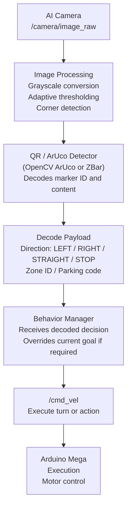
```mermaid
flowchart TD
    CAM_M["AI Camera\n/camera/image_raw"]

    IMG_PROC["Image Processing\nGrayscale conversion\nAdaptive thresholding\nCorner detection"]

    DETECT_M["QR / ArUco Detector\n(OpenCV ArUco or ZBar)\nDecodes marker ID and content"]

    DECODE["Decode Payload\nDirection: LEFT / RIGHT / STRAIGHT / STOP\nZone ID / Parking code"]

    DEC_MGR["Behavior Manager\nReceives decoded decision\nOverrides current goal if required"]

    CMD_M["/cmd_vel\nExecute turn or action"]

    ARD_M["Arduino Mega\nExecution\nMotor control"]

    CAM_M --> IMG_PROC --> DETECT_M --> DECODE --> DEC_MGR --> CMD_M --> ARD_M
```

### 28.3 Marker Decision Mapping

| Marker content | Action | Triggered node |
|---|---|---|
| `LEFT` | Turn left at next junction | `behavior_manager_node` → update goal |
| `RIGHT` | Turn right at next junction | `behavior_manager_node` → update goal |
| `STRAIGHT` | Continue forward | No goal change |
| `STOP` | Stop at marker | Send zero velocity |
| `PARK` | Begin parking sequence | `parking_node` |
| `ROUND_N` | Navigate to round N waypoints | `mission_manager_node` |

> Exact marker format and encoding TBD — depends on competition specification.

---

## 29. Safety Architecture

### 29.1 Safety Priority Stack

```
Highest priority → overrides everything below

  1. HARDWARE EMERGENCY STOP (physical relay)
        ↓
  2. SOFTWARE EMERGENCY STOP (safety_controller_node)
        ↓
  3. COLLISION AVOIDANCE (safety_controller_node — velocity limiting)
        ↓
  4. RECOVERY BEHAVIOR
        ↓
  5. PARKING
        ↓
  6. MISSION NAVIGATION
        ↓
  7. PATH FOLLOWING (lowest priority)

Lower-priority actions CANNOT override higher-priority safety actions.
```

### 29.2 Software Safety Stack

```mermaid
flowchart TD
    subgraph SOFT_SAFE["Software Safety Mechanisms"]
        WD_S["Arduino Watchdog\nIf no CMD_VEL in T_watchdog ms\n→ automatically zero PWM\nFunctions even if RPi hangs"]
        CMD_TO["Command Timeout\n(safety_controller_node)\nIf /cmd_vel silent for T_cmd s\n→ publish zero /cmd_vel_safe"]
        SENS_TO["Sensor Timeout Monitor\nIf any safety-critical sensor\ngoes silent > T_sensor s\n→ degrade or stop"]
        HB["Heartbeat Monitor\nRPi sends PING to Arduino periodically\nMissed N consecutive heartbeats\n→ Arduino zeros PWM"]
        VL_S["Velocity Limiter\nEnforces max_vel_x, max_vel_theta\nmax_acc (TBD values)\nPrevents wheel slip"]
        BATT_S["Battery Monitor\nLow: reduce speed + alert\nCritical: immediate stop"]
        TILT_S["Tilt Monitor\nIMU roll/pitch > threshold (TBD)\n→ immediate stop"]
    end
```

### 29.3 Safety Parameter Summary

| Parameter | Purpose | Value |
|---|---|---|
| `watchdog_timeout_ms` | Arduino motor cutoff if no command | TBD ms |
| `cmd_vel_timeout_s` | RPi side command timeout | TBD s |
| `sensor_timeout_lidar_s` | LiDAR silence trigger | TBD s |
| `sensor_timeout_tof_s` | ToF silence trigger | TBD s |
| `max_linear_velocity` | Speed cap | TBD m/s |
| `max_angular_velocity` | Turn rate cap | TBD rad/s |
| `max_linear_acceleration` | Acceleration cap | TBD m/s² |
| `estop_distance_m` | Critical zone, immediate stop | TBD m |
| `slow_zone_distance_m` | Warning zone, reduce speed | TBD m |
| `battery_low_v` | Reduce speed + warn | TBD V |
| `battery_critical_v` | Stop and lock | TBD V |
| `max_tilt_deg` | Roll/pitch limit | TBD ° |

---

## 30. Emergency Stop

### 30.1 Dual Stop System

```mermaid
flowchart TD
    subgraph HW_E["A. Hardware Emergency Stop"]
        BTN["Physical E-Stop Button\n(Normally Closed relay circuit)"]
        REL["Power Relay\nPhysically opens 24V motor rail"]
        MD_OFF["All 3 Motor Drivers\nPower removed\nMotors coast or brake"]

        BTN --> REL --> MD_OFF
    end

    subgraph SW_E["B. Software Emergency Stop"]
        TRIG_SW["Trigger Sources:\nToF critical distance\nUltrasonic critical distance\nIMU tilt exceeded\nSensor timeout\nCommunication timeout\nManual software command"]
        SC_SW["safety_controller_node\nPublishes /emergency_stop = true\n/cmd_vel_safe → zero"]
        HW_INT_SW["arduino_interface_node\nSends STOP command via serial"]
        ARD_SW["Arduino Mega\nSets all motor PWM to 0\nEnters STOPPED state"]

        TRIG_SW --> SC_SW --> HW_INT_SW --> ARD_SW
    end
```

### 30.2 Stop System Comparison

| Property | Software E-Stop | Hardware E-Stop |
|---|---|---|
| Trigger | Sensor threshold, timeout, command | Physical button press |
| Response time | Software loop latency (TBD ms) | Relay switching (~1 ms) |
| Works if RPi crashes | ❌ | ✅ |
| Works if ROS 2 hangs | ❌ | ✅ |
| Works if Arduino hangs | ❌ | ✅ |
| Works if USB disconnects | ❌ | ✅ |
| Sensor-automatic | ✅ | ❌ (manual button) |
| Required | Yes | Yes — mandatory |

---

## 31. Arduino Firmware Architecture

### 31.1 Firmware Modules (Planned)

```
arduino_firmware/
├── main.ino (or main.cpp)
├── serial_protocol.h/.cpp     ← parse Pi commands, format feedback
├── motor_driver.h/.cpp        ← PWM + DIR output per channel
├── encoder_reader.h/.cpp      ← interrupt-based quadrature decoder
├── pid_controller.h/.cpp      ← generic PID, instantiated ×6
├── velocity_calculator.h/.cpp ← cmd_vel → left/right RPM
├── watchdog_manager.h/.cpp    ← command timeout + hardware watchdog
├── safety_monitor.h/.cpp      ← E-stop status, fault reporting
└── battery_monitor.h/.cpp     ← ADC voltage/current reading (TBD)
```

### 31.2 Arduino Main Loop (Planned)

```cpp
// Planned pseudocode — Arduino Mega

void loop() {
    // 1. Read all encoders (via interrupt counters)
    updateEncoderCounts();

    // 2. Parse incoming serial from Raspberry Pi
    if (serial_available()) {
        parseCommand();          // updates target velocities
        resetWatchdog();
    }

    // 3. Check watchdog timeout
    if (watchdogExpired()) {
        stopAllMotors();         // safety: zero PWM
        sendFault("WATCHDOG_TIMEOUT");
    }

    // 4. Run PID for each motor
    for (int i = 0; i < 6; i++) {
        float measured = getWheelRPM(i);
        float output   = pid[i].compute(target_rpm[i], measured);
        setMotorPWM(i, output);
    }

    // 5. Send odometry and status feedback
    if (feedbackTimer.elapsed()) {
        sendEncoderFeedback();
        sendStatusPacket();
    }
}
```

### 31.3 PWM and Encoder Assignment (TBD)

| Motor | PWM Pin | DIR Pin | Encoder A | Encoder B | Notes |
|---|---|---|---|---|---|
| Left Front | TBD | TBD | TBD | TBD | Interrupt capable |
| Left Mid | TBD | TBD | TBD | TBD | Interrupt capable |
| Left Rear | TBD | TBD | TBD | TBD | Interrupt capable |
| Right Front | TBD | TBD | TBD | TBD | Interrupt capable |
| Right Mid | TBD | TBD | TBD | TBD | Interrupt capable |
| Right Rear | TBD | TBD | TBD | TBD | Interrupt capable |

> Arduino Mega 2560 has 6 hardware interrupt pins (2, 3, 18, 19, 20, 21) and supports pin-change interrupts. For 6 quadrature encoders (12 signals), pin change interrupts must be used for additional encoder channels. Verify timing performance during motor testing.

---

## 32. Raspberry Pi Software Architecture

### 32.1 Software Layer Map

```
Raspberry Pi 5 — Ubuntu 22.04 / 24.04
├── ROS 2 (Humble or Iron)
│   ├── DDS middleware (default: FastDDS)
│   ├── ROS 2 packages (see Section 36)
│   └── Launch system (rover_bringup)
│
├── Sensor drivers
│   ├── LiDAR driver (vendor SDK + ROS 2 node)
│   ├── Camera driver (libcamera / OpenCV)
│   ├── IMU driver (I²C via smbus2 or iio)
│   └── ToF driver (VL53L1X Python/C library)
│
├── Navigation stack (planned: Nav2)
│   ├── slam_toolbox
│   ├── robot_localization (EKF)
│   ├── nav2_planner (A*)
│   ├── nav2_controller (DWA/RPP)
│   └── nav2_costmap_2d
│
├── Serial interface
│   └── pyserial / serial_driver (to Arduino Mega)
│
└── System services
    ├── Watchdog (Pi-side serial timeout)
    ├── Logging (ROS 2 bag / text log)
    └── Diagnostics (diagnostic_updater)
```

---

## 33. Complete Data Flow

### 33.1 Master Data Flow

```mermaid
flowchart TD
    subgraph SENS_LAYER["SENSORS"]
        S_LDR["LiDAR"]
        S_CAM["Camera"]
        S_IMU["IMU"]
        S_TOF["ToF ×3"]
        S_US["Ultrasonic ×2"]
        S_ENC["Encoders ×6"]
    end

    subgraph DRIVER_LAYER["SENSOR DRIVERS (Raspberry Pi)"]
        D_LDR["lidar_node → /scan"]
        D_CAM["camera_node → /camera/image_raw"]
        D_IMU["imu_node → /imu/data"]
        D_TOF["tof_node → /tof/*"]
        D_US["ultrasonic_node → /ultrasonic/*"]
        D_ENC["encoder_interface_node → /odom"]
    end

    subgraph PROC_LAYER["PROCESSING (Raspberry Pi)"]
        PERC_L["perception_node\n→ /camera/detections"]
        SF_L["sensor_fusion_node (EKF)\n→ /odometry/filtered"]
        LOC_L["localization_node\n→ /localization/pose"]
        SLAM_L["slam_node\n→ /map"]
        OBS_L["obstacle_detection_node\n→ /obstacles, costmap"]
    end

    subgraph PLAN_LAYER["PLANNING (Raspberry Pi)"]
        GP_L["global_planner_node\n→ /path"]
        LP_L["local_planner_node\n→ /cmd_vel"]
        BM_L["behavior_manager_node"]
        MM_L["mission_manager_node\n→ /goal_pose"]
    end

    subgraph CTRL_LAYER["CONTROL (Raspberry Pi)"]
        SC_L["safety_controller_node\n→ /cmd_vel_safe"]
        AIN_L["arduino_interface_node\n→ serial TX"]
    end

    subgraph MCU_LAYER["ARDUINO MEGA"]
        WC_L["Velocity calculation\nPID × 6\nPWM output"]
    end

    subgraph ACT_LAYER["ACTUATORS"]
        MD_L["Motor Drivers × 3"]
        M_L["6 DC Motors"]
    end

    S_LDR --> D_LDR
    S_CAM --> D_CAM
    S_IMU --> D_IMU
    S_TOF --> D_TOF
    S_US --> D_US
    S_ENC -->|"via Arduino serial"| D_ENC

    D_CAM --> PERC_L
    D_LDR --> SF_L & SLAM_L & OBS_L
    D_IMU --> SF_L
    D_ENC --> SF_L

    SF_L --> LOC_L
    SLAM_L --> GP_L & LOC_L
    LOC_L --> GP_L & BM_L & MM_L
    PERC_L --> BM_L
    OBS_L --> LP_L & SC_L
    MM_L --> GP_L
    GP_L --> LP_L
    LP_L --> SC_L
    BM_L --> SC_L

    D_TOF --> SC_L
    D_US --> SC_L
    SC_L --> AIN_L --> MCU_LAYER
    MCU_LAYER --> MD_L --> M_L
    M_L -->|"encoder feedback"| S_ENC
```

### 33.2 Safety Parallel Path

```mermaid
flowchart LR
    subgraph SAFE_INPUTS["Safety Inputs"]
        TOF_SF["ToF distance"]
        US_SF["Ultrasonic distance"]
        IMU_SF["IMU tilt"]
        ARD_WD["Arduino watchdog status"]
        BATT_SF["Battery voltage"]
        ESTOP_BTN["E-Stop button"]
    end

    SCN_SF["safety_controller_node"]

    subgraph SAFE_OUTPUTS["Safety Outputs"]
        VL_SF["Velocity limit\n→ /cmd_vel_safe"]
        ESTOP_SF["Software E-stop\n→ /emergency_stop"]
        HW_ESTOP_SF["Hardware E-stop\n→ Motor relay"]
    end

    TOF_SF & US_SF & IMU_SF & ARD_WD & BATT_SF --> SCN_SF
    SCN_SF --> VL_SF & ESTOP_SF
    ESTOP_BTN --> HW_ESTOP_SF
```

---

## 34. Hardware BOM

> This is a **preliminary BOM**. All prices are TBD. Motor driver selection **must** be verified against measured motor stall current before purchase.

| # | Component | Qty | Purpose | Interface | Voltage | Processor | Status | Notes |
|---|---|---|---|---|---|---|---|---|
| 1 | Raspberry Pi 5 (8 GB) | 1 | High-level compute, ROS 2 | USB, UART, CSI, I²C, SPI | 5 V | — | TBD | 4 GB variant may be tested |
| 2 | Arduino Mega 2560 | 1 | Real-time motor control, encoder I/O | UART, GPIO, PWM | 5 V | — | TBD | Existing from previous rover |
| 3 | 360° 2D LiDAR | 1 | SLAM, obstacle mapping | USB / UART | TBD V | Raspberry Pi | TBD | Model TBD (e.g. RPLiDAR A1/A2, YDLIDAR) |
| 4 | AI Camera (IMX500-class) | 1 | Object / marker detection | CSI / USB | TBD V | Raspberry Pi | TBD | Raspberry Pi AI Camera or equivalent |
| 5 | VL53L1X ToF Sensor | 3 | Short-range obstacle detection, parking | I²C | 3.3 V | Raspberry Pi | TBD | XSHUT pin per sensor for address multiplexing |
| 6 | JSN-SR04T Ultrasonic | 2 | Backup safety proximity | GPIO Trig/Echo | 5 V | Arduino or RPi | TBD | Waterproof variant preferred |
| 7 | MPU-9250 or BNO085 IMU | 1 | Orientation, angular velocity, sensor fusion | I²C / SPI | 3.3 V | Raspberry Pi | TBD | MPU-9250 from previous rover; BNO085 if upgrading |
| 8 | GPS Module (e.g. NEO-6M) | 1 | Optional global position reference | UART | 3.3/5 V | Raspberry Pi | Optional | Only if competition requires outdoor GPS waypoints |
| 9 | Geared DC Motor with Encoder | 6 | Wheel drive + closed-loop control | PWM + DIR, encoder GPIO | TBD V | Arduino Mega | TBD | Rated V, current, stall current all TBD |
| 10 | Dual-channel Brushed DC Motor Driver | 3 | Drive 6 motors (2 per driver) | PWM + DIR | TBD V / TBD A | Arduino Mega | TBD | **Verify stall current before selecting** |
| 11 | 24 V Li-ion Battery Pack | 1 | Main power source | XT60 / TBD | 24 V | — | TBD | Capacity TBD Ah, chemistry TBD |
| 12 | Battery Management System (BMS) | 1 | Battery protection | Inline | 24 V | — | TBD | Match to battery chemistry and cell count |
| 13 | 24 V → 5 V DC-DC Converter | 1+ | Raspberry Pi power | Output terminals | 5 V, ≥5 A | — | TBD | Must sustain RPi 5 peak draw |
| 14 | 24 V → 3.3/5 V DC-DC (sensors) | 1 | Clean regulated sensor power | Output terminals | 3.3/5 V | — | TBD | Isolated from motor branch |
| 15 | 24 V → 5 V DC-DC (Arduino) | 1 | Arduino power | Output terminals | 5 V | — | TBD | May share with sensor converter if budgeted |
| 16 | Hardware E-Stop Button + Relay | 1 | Physical motor power cutoff | NC relay in 24 V motor rail | 24 V | — | TBD | Must interrupt motor power independently |
| 17 | Main Fuse(s) | 2+ | Overcurrent protection | Inline, 24 V | 24 V | — | TBD | Ratings TBD — measure peak current |
| 18 | Power Distribution Board | 1 | Distribute 24 V to all branches | XT30/XT60 terminals | 24 V | — | TBD | — |
| 19 | Voltage/Current Monitor (INA219) | 1+ | Battery state monitoring | I²C | 3.3/5 V | Arduino / RPi | TBD | Or integrated BMS telemetry |
| 20 | Rover Chassis | 1 | Mechanical structure | Mechanical | — | — | TBD | Must accommodate rocker-bogie geometry |
| 21 | Rocker-Bogie Suspension Kit | 1 | Passive terrain-adapting suspension | Mechanical | — | — | TBD | Custom fabricated or commercial |
| 22 | High-grip Wheels | 6 | Traction on varied terrain | Hub / hex shaft | — | — | TBD | Diameter TBD |
| 23 | Wiring, Connectors, Heat-shrink | — | System integration | — | — | — | TBD | AWG TBD after measuring current |
| 24 | MicroSD Card (64+ GB, high-endurance) | 1 | Raspberry Pi OS + bag files | microSD | — | — | TBD | High-endurance card recommended |
| 25 | USB Cable (Type-A to Type-B) | 1 | Raspberry Pi → Arduino serial | USB | — | — | TBD | Quality, strain-relieved |
| 26 | I²C Level Shifter | TBD | RPi 3.3 V ↔ Arduino 5 V sensors | I²C | 3.3–5 V | — | TBD | If mixing 3.3 V and 5 V I²C devices |

---

## 35. Software Stack

| Layer | Software | Version | Status |
|---|---|---|---|
| OS | Ubuntu 22.04 LTS (64-bit) | 22.04 | TBD |
| ROS 2 | ROS 2 Humble Hawksbill (or Iron) | Humble | TBD |
| SLAM | slam_toolbox | latest compatible | 🟡 Planned |
| Sensor fusion / EKF | robot_localization | latest compatible | 🟡 Planned |
| Navigation | Nav2 | latest compatible | 🟡 Planned |
| Global planner | Nav2 SmacPlanner2D (A*) | — | 🟡 Planned |
| Local planner | Nav2 DWBLocalPlanner | — | 🟡 Planned |
| LiDAR driver | Vendor-specific ROS 2 package | TBD | 🟡 Planned |
| Camera driver | libcamera + ROS 2 wrapper | TBD | 🟡 Planned |
| IMU driver | MPU-9250 / BNO085 ROS 2 node | TBD | 🟡 Planned |
| ToF driver | VL53L1X Python / C library | TBD | 🟡 Planned |
| Computer vision | OpenCV | 4.x | 🟡 Planned |
| ArUco detection | OpenCV ArUco module | 4.x | 🟡 Planned |
| Serial interface | pyserial or ros2_serial | TBD | 🟡 Planned |
| Arduino firmware | Arduino framework (AVR-GCC) | TBD | 🟡 Planned |
| Simulation | Gazebo Harmonic or Classic | TBD | 🟡 Planned |
| Visualization | RViz2 | ROS 2 native | 🟡 Planned |

---

## 36. Folder Structure

```
rover_ws/                              ← ROS 2 workspace root
│
├── src/                               ← All ROS 2 packages
│   │
│   ├── rover_bringup/                 🟡 PLANNED
│   │   ├── launch/
│   │   │   ├── rover_hardware.launch.py
│   │   │   ├── rover_sim.launch.py
│   │   │   └── rover_full.launch.py
│   │   ├── config/
│   │   │   ├── ekf_params.yaml
│   │   │   ├── slam_params.yaml
│   │   │   ├── nav2_params.yaml
│   │   │   ├── safety_params.yaml
│   │   │   └── mission.yaml
│   │   └── package.xml
│   │
│   ├── rover_description/             🟡 PLANNED
│   │   ├── urdf/
│   │   │   └── rover.urdf.xacro
│   │   ├── meshes/
│   │   └── package.xml
│   │
│   ├── rover_sensors/                 🟡 PLANNED
│   │   ├── rover_sensors/
│   │   │   ├── lidar_node.py
│   │   │   ├── camera_node.py
│   │   │   ├── imu_node.py
│   │   │   ├── tof_node.py
│   │   │   └── ultrasonic_node.py
│   │   └── package.xml
│   │
│   ├── rover_perception/              🟡 PLANNED
│   │   ├── rover_perception/
│   │   │   ├── perception_node.py
│   │   │   └── obstacle_detection_node.py
│   │   ├── models/
│   │   └── package.xml
│   │
│   ├── rover_localization/            🟡 PLANNED
│   │   ├── rover_localization/
│   │   │   ├── sensor_fusion_node.py
│   │   │   └── localization_node.py
│   │   └── package.xml
│   │
│   ├── rover_slam/                    🟡 PLANNED
│   │   ├── config/
│   │   ├── launch/
│   │   └── package.xml
│   │
│   ├── rover_navigation/              🟡 PLANNED
│   │   ├── rover_navigation/
│   │   │   ├── global_planner_node.py
│   │   │   └── local_planner_node.py
│   │   ├── config/
│   │   └── package.xml
│   │
│   ├── rover_control/                 🟡 PLANNED
│   │   ├── rover_control/
│   │   │   ├── motion_controller_node.py
│   │   │   └── arduino_interface_node.py
│   │   └── package.xml
│   │
│   ├── rover_behaviors/               🟡 PLANNED
│   │   ├── rover_behaviors/
│   │   │   ├── behavior_manager_node.py
│   │   │   ├── mission_manager_node.py
│   │   │   ├── parking_node.py
│   │   │   └── recovery_node.py
│   │   ├── config/
│   │   └── package.xml
│   │
│   ├── rover_manipulation/            🟡 PLANNED
│   │   ├── rover_manipulation/
│   │   │   ├── manipulation_manager_node.py
│   │   │   ├── arm_controller_node.py
│   │   │   └── gripper_controller_node.py
│   │   ├── config/
│   │   └── package.xml
│   │
│   └── rover_safety/                  🟡 PLANNED
│       ├── rover_safety/
│       │   └── safety_controller_node.py
│       ├── config/
│       └── package.xml
│
├── arduino_firmware/                  🟡 PLANNED
│   └── rover_firmware/
│       ├── rover_firmware.ino (or main.cpp)
│       ├── serial_protocol.h
│       ├── motor_driver.h
│       ├── encoder_reader.h
│       ├── pid_controller.h
│       ├── velocity_calculator.h
│       ├── watchdog_manager.h
│       └── safety_monitor.h
│
├── maps/                              🟡 PLANNED
│   ├── competition_track.yaml
│   └── competition_track.pgm
│
├── scripts/                           🟡 PLANNED
│   ├── build.sh
│   ├── run_tests.sh
│   └── record_bag.sh
│
├── logs/                              🟡 PLANNED
│
└── README.md                          ← This document
```

> All directories marked 🟡 PLANNED are the **recommended architecture**. None of these directories currently exist in the repository. Create them as implementation progresses.

---

## 37. Testing Strategy

Testing must proceed **strictly bottom-up**. A higher-level module must not be tested until all its dependencies have passed their individual tests.

| Level | Test | Objective | Input | Expected Result | Failure Condition |
|---|---|---|---|---|---|
| **1** | Power system | Verify all voltage rails within spec | Apply battery | All rails at correct voltage, BMS active, fuses intact | Rail out of tolerance, BMS not responding |
| **2** | Arduino serial | Verify RPi ↔ Arduino communication | Send test packet | Arduino echoes PONG response | No response, timeout, garbled data |
| **3** | Single motor | Verify one motor spins correctly | Manual PWM command | Motor spins in both directions, no binding | No motion, reversed direction, excessive current |
| **4** | Six motors | Verify all 6 motors respond | Sequential motor commands | All 6 motors respond, no cross-wiring | Any motor fails to respond |
| **5** | Encoder | Verify encoder pulses | Rotate motor by hand | Correct pulse count, correct direction | Wrong count, no pulses, direction error |
| **6** | PID | Verify closed-loop RPM tracking | Step command via serial | Tracks target RPM within ±5% at steady state | Oscillation, steady-state error, instability |
| **7** | IMU | Verify orientation output | Tilt rover by known angle | Orientation matches physical angle | Drift, wrong axis, noisy output |
| **8** | LiDAR | Verify scan data | Place rover in test space | Clean 360° scan, correct distances | Missing sectors, wrong distances, no data |
| **9** | ToF | Verify range accuracy | Known-distance targets | Distance within ±5 cm over 0–3 m | Out of range, I²C errors, wrong reading |
| **10** | Ultrasonic | Verify range accuracy | Known-distance targets | Distance within ±10 cm over 0.2–4 m | Out of range, no echo |
| **11** | Camera | Verify image capture and detection | Show test object/marker | Image published, detection returned | No image, detection failure |
| **12** | Odometry | Verify encoder → odometry | Drive straight 1 m | Position error < TBD % | Large position error, drift |
| **13** | Sensor fusion | Verify EKF output stability | Drive + turn sequence | Reduced drift vs raw encoder | EKF divergence, worse than raw odom |
| **14** | SLAM | Verify map building | Drive around test area | Consistent occupancy grid built | Map corruption, localization jump |
| **15** | A\* planner | Verify global path generation | Set goal in known map | Valid path generated avoiding obstacles | No path, path through obstacle |
| **16** | Local obstacle avoidance | Verify dynamic avoidance | Place obstacle in path | Rover stops or detours | Collision, ignores obstacle |
| **17** | Dynamic obstacle | Verify wait-and-resume | Moving obstacle crosses path | Rover stops, waits, resumes | Collision, does not resume |
| **18** | Parking | Verify parking state machine | Start parking sequence | Rover enters zone, aligns, stops correctly | Overshoot, misalignment, no stop |
| **19** | Recovery | Verify recovery behaviors | Block path permanently | Rover reverses, replans, or safe-stops | Stuck, collision, loop |
| **20** | Full autonomous lap | Verify end-to-end | Start competition | Completes full lap without intervention | Any unplanned stop or collision |
| **21** | 6–7 lap endurance | Verify reliability | 7 consecutive runs | All 7 laps complete, no failures | Any failure across 7 runs |

---

## 38. Failure Handling

### 38.1 Failure Safety Matrix

| Failure | Detection Method | Immediate Action | Recovery Strategy | Final Safe State |
|---|---|---|---|---|
| LiDAR failure | `/diagnostics` topic timeout, no `/scan` | Slow to minimum speed, alert | Switch to ToF + ultrasonic only mode | Slow crawl with reduced obstacle detection |
| Camera failure | `/diagnostics` timeout, no `/camera/*` | Disable semantic detection | Continue without camera, log warning | Navigation continues, no marker detection |
| ToF failure | `/diagnostics` timeout, no `/tof/*` | Increase safety margins | Continue with LiDAR + ultrasonic | Reduced close-range sensing |
| Ultrasonic failure | `/diagnostics` timeout | Log warning | Continue with LiDAR + ToF | Reduced backup safety |
| IMU failure | `/diagnostics` timeout | Use encoder odometry only | Increase heading PID gain | Reduced heading stability |
| Encoder failure (1 motor) | Arduino fault packet, velocity anomaly | Reduce/zero that motor | Limp-home (5-motor mode if feasible) | Degraded motion, possible stop |
| Arduino serial timeout | RPi serial watchdog, no PONG | Publish `/emergency_stop = true` | Attempt serial reconnect | Motor zero via Arduino watchdog |
| Raspberry Pi crash | Arduino watchdog (no CMD_VEL) | Arduino zeros all PWM automatically | Hardware reboot (if WDT enabled) | Motors stopped, hardware E-stop if available |
| Motor driver fault | Arduino overcurrent detection or temp | Zero PWM on that driver, send fault | Stop affected wheels | Partial motion or full stop |
| Overcurrent (motor) | Motor driver OCP or current monitor | Reduce PWM, send fault to RPi | Reduce speed, check for jam | Stop if unresolved |
| Low battery | Battery monitor, voltage < low_threshold | Reduce max speed, warn operator | Complete current action, return to start | Stationary with motors off |
| Critical battery | Voltage < critical threshold | Immediate stop, lock motors | None — operator intervention | Motors off, rover stationary |
| Excessive tilt | IMU roll or pitch > threshold | Immediate motor stop | Do not resume until tilt resolved | Stationary |
| Obstacle too close | ToF / ultrasonic < critical distance | Immediate stop (`/emergency_stop`) | Reverse, replan | Stationary or recovery |
| Planner failure | No `/path` published within timeout | Stop rover | Trigger recovery node, retry planner | Safe stop |
| Localization failure | Pose covariance > threshold | Slow, stop safely | AMCL particle filter reinitialisation | Safe stop if reinit fails |

---

## 39. Simulation

### 39.1 Why Simulate Before Hardware Testing?

Simulation allows full software stack development and testing before hardware is complete, reducing the risk of hardware damage and accelerating development.

```mermaid
flowchart TD
    URDF["URDF / Xacro\nRover 3D model\nSensor positions\nMass/inertia (TBD)"]
    GAZ["Gazebo Simulator\nPhysics engine\nSimulated terrain\nSimulated sensors"]
    SIM_SENS["Simulated Sensors\n/scan (ray plugin)\n/imu/data (IMU plugin)\n/odom (diff_drive plugin)\n/camera/image_raw"]
    ROS2_SIM["ROS 2 — identical software stack\nNo code changes required"]
    NAV_SIM["SLAM / Nav2 / Behavior nodes"]
    RVIZ_SIM["RViz2\nVisualization and debugging"]

    URDF --> GAZ
    GAZ --> SIM_SENS --> ROS2_SIM
    ROS2_SIM --> NAV_SIM
    ROS2_SIM --> RVIZ_SIM
```

### 39.2 Simulation Components

| Component | Tool | Status |
|---|---|---|
| Robot description | URDF/Xacro | 🟡 Planned |
| Physics simulation | Gazebo Harmonic / Classic | 🟡 Planned |
| LiDAR simulation | `gazebo_ros_ray_sensor` plugin | 🟡 Planned |
| IMU simulation | `gazebo_ros_imu_sensor` plugin | 🟡 Planned |
| Differential drive | `gazebo_ros_diff_drive` plugin | 🟡 Planned |
| Camera simulation | `gazebo_ros_camera` plugin | 🟡 Planned |
| Competition track | Custom Gazebo world file | 🟡 Planned |
| Visualisation | RViz2 | 🟡 Planned |

### 39.3 Development Workflow

```
RECOMMENDED DEVELOPMENT ORDER:
══════════════════════════════════════════════════════
1. Develop and test algorithms in Gazebo simulation
   → Iterate until correct in simulation
2. Transfer to physical rover in safe open space
   → Tune PID, EKF noise, planner costs
3. Test on competition-representative terrain
   → Tune safety thresholds, recovery triggers
4. Full-lap testing
5. 6–7 lap endurance testing
6. Competition

NEVER skip simulation before hardware testing.
NEVER run unknown code on the physical rover at full speed.
══════════════════════════════════════════════════════
```

---

## 40. Previous vs New Rover

| Feature | Previous Rover | New Rover | Change | Action |
|---|---|---|---|---|
| High-level processor | Raspberry Pi 4B | Raspberry Pi 5 8 GB | Hardware upgrade | UPGRADE |
| Low-level controller | Arduino Mega 2560 | Arduino Mega 2560 | Retained | KEEP |
| LiDAR | RPLiDAR A1M8 | RPLiDAR A1M8 or better | Verify upgrade value | TO VERIFY |
| Camera | Raspberry Pi Camera | Raspberry Pi AI Camera (IMX500) | Upgrade to AI camera | UPGRADE |
| IMU | MPU-9250 | MPU-9250 or BNO085 | Upgrade if BNO085 is easier | TO VERIFY |
| GPS | NEO-6M | NEO-6M (optional) | Retain as optional | OPTIONAL |
| ToF sensor | VL53L0X | VL53L1X (longer range) | Upgrade to L1X | UPGRADE |
| Ultrasonic | HC-SR04 | JSN-SR04T (waterproof) | Upgrade for robustness | UPGRADE |
| Serial protocol | Basic serial | Structured protocol with checksum | Improved | UPGRADE |
| Motor control | Basic PWM | Closed-loop PID per wheel | Improved | UPGRADE |
| Odometry | Basic encoder counting | EKF-fused odometry | Improved | UPGRADE |
| SLAM | Basic SLAM | slam_toolbox with known-map mode | Improved | UPGRADE |
| Localization | Basic | AMCL on pre-built map | Improved | UPGRADE |
| Obstacle avoidance | Basic | Layered multi-sensor system | Improved | UPGRADE |
| Parking | Not dedicated | Dedicated parking state machine | New | NEW |
| Recovery | Basic | Structured recovery state machine | Improved | UPGRADE |
| Mission manager | Basic | Round-configurable mission FSM | Improved | UPGRADE |
| Marker detection | QR / basic | QR + ArUco with behavior integration | Improved | UPGRADE |
| Hardware E-stop | TBD | Independent physical relay | New | NEW |
| Safety architecture | Basic | Multi-layer software + hardware | Improved | UPGRADE |
| Testing methodology | Ad-hoc | 21-level staged test plan | New | NEW |
| ROS 2 architecture | Monolithic | Modular package architecture | Improved | UPGRADE |
| Simulation | None documented | Gazebo + RViz2 | New | NEW |

---

## 41. Known Limitations

This section documents known limitations honestly. Engineering teams and competition judges should be aware of the following.

| Limitation | Root Cause | Mitigation |
|---|---|---|
| 2D LiDAR blind spot below scan plane | Fixed scan height | VL53L1X ToF sensors at lower height |
| LiDAR cannot detect transparent/absorbing surfaces | Laser reflection physics | Camera provides semantic backup |
| Camera degrades in low light | CMOS sensor SNR | Ensure adequate course lighting; camera is not sole sensor |
| ToF range limited to ~4 m | VL53L1X sensor spec | LiDAR covers beyond 4 m |
| Ultrasonic false readings on angled surfaces | Specular reflection | Treat as backup only; LiDAR and ToF are primary |
| Wheel slip on slippery surfaces | Friction physics | Encoder monitoring detects slip; rocker-bogie distributes load |
| IMU gyro drift over time | MEMS sensor drift | EKF fusion with encoder limits accumulated error |
| Skid steering on hard surfaces | Side-wheel friction | Acceptable on typical competition terrain |
| GPS accuracy (~1–3 m) | GPS physics | Not used as primary parking sensor; ToF + LiDAR used for precision |
| Raspberry Pi thermal throttling | ARM SoC TDP | Add active cooling; monitor CPU temperature during runs |
| Arduino interrupt limit (6 hard interrupts) | ATmega2560 hardware | Use pin-change interrupts for additional encoder channels |
| ROS 2 node crash recovery latency | Linux process restart | Watchdog restarts nodes; hardware E-stop as final backup |
| Motor driver thermal limits | Sustained high current | Allow thermal settling; select drivers with adequate current headroom |
| Battery voltage sag under motor load | Internal resistance | Monitor voltage, trigger low-battery alert before brownout |
| 2D SLAM failure in featureless environments | Insufficient scan features | Pre-build map on course; add fiducial landmarks if needed |
| Online SLAM divergence risk during competition | Probabilistic estimation | Use known-map + AMCL for competition runs |

---

## 42. Implementation Status

| Module | Status |
|---|---|
| Repository created | ✅ Done |
| README (this document) | ✅ Done |
| URDF / robot description | 🟡 Planned |
| LiDAR driver node | 🟡 Planned |
| Camera driver node | 🟡 Planned |
| IMU driver node | 🟡 Planned |
| ToF driver node | 🟡 Planned |
| Ultrasonic node | 🟡 Planned |
| Arduino serial firmware | 🟡 Planned |
| Encoder interface node | 🟡 Planned |
| Odometry calculation | 🟡 Planned |
| EKF sensor fusion | 🟡 Planned |
| SLAM (slam_toolbox) | 🟡 Planned |
| AMCL localization | 🟡 Planned |
| Global planner (A\*) | 🟡 Planned |
| Local planner (DWA) | 🟡 Planned |
| Obstacle detection node | 🟡 Planned |
| Safety controller | 🟡 Planned |
| Behavior manager | 🟡 Planned |
| Mission manager | 🟡 Planned |
| Parking node | 🟡 Planned |
| Recovery node | 🟡 Planned |
| QR / ArUco detection | 🟡 Planned |
| Motor PID (Arduino) | 🟡 Planned |
| Heading control | 🟡 Planned |
| Hardware E-stop | 🟡 Planned |
| Gazebo simulation | 🟡 Planned |
| RViz2 configuration | 🟡 Planned |

> Status key: ✅ Done · 🟢 Implemented · 🟠 In Development · 🟡 Planned · 🔴 Not Started

Update this table as implementation progresses.

---

## 43. Development Roadmap

| Phase | Milestone | Modules | Status |
|---|---|---|---|
| **Phase 1** | Hardware bring-up | Chassis, wiring, power system, E-stop, motor drivers | 🟡 Planned |
| **Phase 2** | Arduino firmware | Serial protocol, motor PWM, encoder reading | 🟡 Planned |
| **Phase 3** | Motor PID | Closed-loop RPM control, all 6 motors | 🟡 Planned |
| **Phase 4** | Sensor drivers | LiDAR, IMU, ToF, ultrasonic, camera | 🟡 Planned |
| **Phase 5** | Odometry | Encoder → `/odom`, straight-line accuracy test | 🟡 Planned |
| **Phase 6** | Sensor fusion | EKF (robot_localization), encoder + IMU | 🟡 Planned |
| **Phase 7** | SLAM | slam_toolbox bring-up, map building | 🟡 Planned |
| **Phase 8** | Known-map localization | AMCL on pre-built competition map | 🟡 Planned |
| **Phase 9** | Obstacle detection | Multi-sensor fusion, costmap integration | 🟡 Planned |
| **Phase 10** | Global planning | A\* via Nav2, waypoint navigation | 🟡 Planned |
| **Phase 11** | Local planning | DWA, dynamic avoidance | 🟡 Planned |
| **Phase 12** | Behavior manager | Mission FSM, round sequencing | 🟡 Planned |
| **Phase 13** | Parking | Parking state machine, ToF alignment | 🟡 Planned |
| **Phase 14** | Recovery | Recovery behaviors, failure handling | 🟡 Planned |
| **Phase 15** | QR/marker detection | ArUco detection, direction decisions | 🟡 Planned |
| **Phase 16** | Safety integration | Safety controller, parameter tuning | 🟡 Planned |
| **Phase 17** | Simulation | Gazebo, URDF, test algorithms | 🟡 Planned |
| **Phase 18** | Full-track testing | Single autonomous lap | 🟡 Planned |
| **Phase 19** | Endurance testing | 6–7 consecutive laps, reliability | 🟡 Planned |
| **Phase 20** | Competition preparation | Parameter lock, backup firmware, documentation | 🟡 Planned |

---

## 44. Future Improvements

These are not in the current implementation plan. They may be evaluated for future competition seasons.

| Improvement | Benefit | Complexity |
|---|---|---|
| 3D LiDAR | Eliminates 2D blind spot, full 3D environment map | High (cost + compute) |
| Stereo / RGB-D camera | Dense depth perception, improved small-object detection | Medium |
| RTK-GPS | Centimetre-level global positioning | Medium (cost) |
| CAN bus (RPi ↔ Arduino) | Noise immunity, multi-node expansion, standard automotive interface | Medium |
| micro-ROS on Arduino | Arduino appears as native ROS 2 node, removes custom serial protocol | Medium |
| Behavior Trees (BehaviorTree.CPP) | More maintainable, testable, debuggable behavior management | Medium |
| ROS 2 Control framework | Standard hardware interface abstraction, ros2_control integration | Medium |
| Adaptive / MPC motor control | Better response under varying load, terrain-aware velocity profiling | High |
| Active suspension | Hydraulic or servo-controlled rocker adaptation | Very High |
| Multi-rover coordination | Team-based navigation for cooperative events | Very High |

---

## 45. Team / Project Information

| Field | Value |
|---|---|
| **Project** | Autonomous Rocker-Bogie Rover |
| **Competition** | ROBOFEST |
| **Team** | TBD |
| **Institution** | TBD |
| **Year** | 2026 |
| **Contact** | TBD |
| **Licence** | TBD |

---

## Appendix A — Quick Reference Commands (Planned)

```bash
# Build workspace
cd ~/rover_ws
colcon build --symlink-install
source install/setup.bash

# Launch hardware mode
ros2 launch rover_bringup rover_hardware.launch.py

# Launch simulation mode
ros2 launch rover_bringup rover_sim.launch.py

# Monitor key topics
ros2 topic echo /localization/pose
ros2 topic echo /cmd_vel_safe
ros2 topic echo /diagnostics

# Software emergency stop
ros2 topic pub /emergency_stop std_msgs/Bool "data: true" --once

# Check safety node
ros2 node info /safety_controller_node

# Record ROS 2 bag
ros2 bag record -a -o logs/run_$(date +%Y%m%d_%H%M%S)
```

---

## Appendix B — Glossary

| Term | Definition |
|---|---|
| **A\*** | A-star search algorithm for optimal path planning on a grid |
| **AMCL** | Adaptive Monte Carlo Localization — particle filter for localization on a known map |
| **ArUco** | A type of fiducial marker detectable by OpenCV |
| **BMS** | Battery Management System |
| **cmd_vel** | ROS 2 velocity command topic (`geometry_msgs/Twist`) |
| **DWA** | Dynamic Window Approach — local path planning algorithm |
| **EKF** | Extended Kalman Filter — non-linear sensor fusion estimator |
| **E-Stop** | Emergency Stop |
| **IMU** | Inertial Measurement Unit |
| **LiDAR** | Light Detection and Ranging |
| **MCU** | Microcontroller Unit (Arduino Mega 2560) |
| **Nav2** | Navigation2 — the standard ROS 2 autonomous navigation framework |
| **Odometry** | Pose estimate from wheel encoder integration |
| **PID** | Proportional-Integral-Derivative controller |
| **PWM** | Pulse Width Modulation |
| **Rocker-Bogie** | Passive six-wheel suspension system |
| **ROS 2** | Robot Operating System 2 |
| **RPi5** | Raspberry Pi 5 |
| **SLAM** | Simultaneous Localization and Mapping |
| **TF** | Transform — coordinate frame in ROS 2 |
| **ToF** | Time of Flight distance sensor (VL53L1X) |
| **URDF** | Unified Robot Description Format |
| **Waypoint** | A target pose the rover must navigate to |

---

*Document version: 2.0.0 — Architecture Specification*
*Repository status: Bring-Up Phase — No software implemented*
*Generated: 2026-08-17*
*Previous rover: Generation 1 (Raspberry Pi 4B + Arduino Mega + basic navigation)*
*Current rover: Generation 2 (Raspberry Pi 5 + Arduino Mega + modular ROS 2 architecture)*
